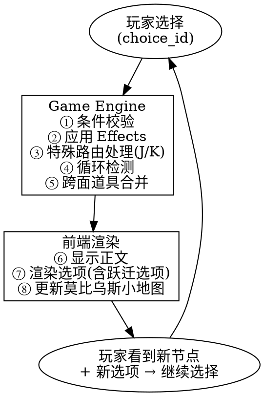

# Cycle Master — 技术实现方案 v1.1

> **项目定位**：莫比乌斯环无限循环视觉小说游戏  
> **核心理念**：剧本 = 有向循环图，玩游戏 = 状态在图上遍历（借鉴 LangGraph 状态图思想）  
> **平台策略**：Web 优先（Vue 3），后期通过 Tauri 打包桌面应用

---

## 一、技术栈总览

| 层 | 技术 | 说明 |
|---|---|---|
| 前端框架 | **Vue 3 + Vite** | Composition API + `<script setup>` |
| 前端语言 | **TypeScript** | 类型安全，减少运行时错误 |
| UI 组件库 | **Element Plus** | 成熟稳定的 Vue 3 组件库 |
| 图渲染（编辑画布） | **Cytoscape.js** | 完整的图节点/边操作能力 |
| 图渲染（游戏小地图） | **手写 SVG** | 环形进度条 + 莫比乌斯扭转示意，轻量无需重型库 |
| 状态管理 | **Pinia** | Vue 官方推荐状态管理 |
| 样式方案 | **SCSS** | 视觉小说对自定义样式需求高 |
| 后端框架 | **Python 3.12 + FastAPI** | 异步高性能，原生 Pydantic 集成 |
| ORM | **SQLAlchemy 2.0** | ORM + 原生 SQL 可混用 |
| 数据校验 | **Pydantic v2** | FastAPI 原生集成，类型安全 |
| 数据库 | **SQLite** | 零配置，单文件部署 |
| 桌面打包（未来） | **Tauri 2.x** | 比 Electron 更轻量 |

---

## 二、核心设计理念：图节点状态机

### 2.1 莫比乌斯环的图模型

```
莫比乌斯环展开（俯视图）：

  A(0) ──→ B(25) ──→ C(50) ──→ D(75)
   ↑  ↑                            │
   │  └──── J(捷径) ←───────────────┤
   │                                ↓
  H(175) ←── G(150) ←── F(125) ←── E(100)
   │                                │
   └────────────────────────────────┘
       （回到 A = 一次循环完成）

  K(跃迁枢纽) — 独立于环面，可从任意节点（满足条件时）进入，
               从 K 可跳转到任意主节点
```

#### 节点体系

**主节点（8 个，A~H）**：每 25 单位一个，构成环形骨架

| ID | 名称 | 位置 | 说明 |
|---|---|---|---|
| A | 起点/终点 | 0 | 每次回到 A = 一次循环完成 + 结局生成 |
| B | 主节点 B | 25 | |
| C | 主节点 C | 50 | |
| D | 主节点 D | 75 | |
| E | 镜像节点 | 100 | 莫比乌斯环的中点，A 的正下方（另一面），与 A 部分道具跨面共享 |
| F | 主节点 F | 125 | |
| G | 主节点 G | 150 | |
| H | 主节点 H | 175 | |

**特殊节点（2 个，J、K）**：

| ID | 名称 | 类型 | 行为 |
|---|---|---|---|
| J | 捷径节点 | `special_shortcut` | 条件满足时：E → J → A，提供一条缩短路径回到起点的路线 |
| K | 跃迁枢纽 | `special_warp` | 条件满足时：任意节点可进入 K；在 K 内可选择跳转到任意主节点 |

**普通节点**（若干）：散落在主节点之间，由编剧自由放置，不固定位置。

#### 关键规则

- **边（Choice）** = 玩家的选择，每条边从当前节点指向下一个节点
- **边的条件** = 状态谓词，根据玩家属性/道具/历史选择决定是否可用
- **方向**：沿环面单向推进（但 K 可打破单向约束）
- **循环判定**：回到节点 A 即完成一次循环（无论走完整圈还是 J 捷径）
- **莫比乌斯扭转**：E(100) 位于 A(0) 的正下方，环面扭转 180° 后的另一面
- **跨面道具**：部分道具可在 A 和 E 之间共享（`cross_surface=true`）

### 2.2 类比 LangGraph

| LangGraph 概念 | 本游戏对应 |
|---|---|
| `StateGraph` | 整个故事剧本 |
| `Node` | 故事节点（一段对话/旁白） |
| `Edge` | 玩家选择（Choice） |
| `ConditionalEdge` | 带条件的选项（需某道具/某标记才可触发） |
| `GraphState` | `GameState`（携带道具、标记、循环数） |
| `node update` | `Effect`（选择带来的状态变更） |
| `graph.invoke()` | `engine.process_choice()`（处理选择，推进游戏） |
| `Router` | `special_router.py`（K/J 特殊节点的动态路由） |

---

## 三、数据模型

### 3.1 核心对象定义

```python
from enum import Enum

class NodeType(str, Enum):
    MAIN = "main"                        # A~H 主节点
    NORMAL = "normal"                    # 普通剧情节点
    SPECIAL_SHORTCUT = "special_shortcut" # J 类型 — 条件捷径
    SPECIAL_WARP = "special_warp"        # K 类型 — 跃迁枢纽

class StoryNode:
    id: str                              # 唯一标识，如 "A", "B", "node_023"
    name: str                            # 显示名称
    position: float                      # 环面上位置 (0 ~ 200 单位长度)
    node_type: NodeType                  # 节点类型（替代旧版 is_key_node）
    content: str                         # 正文（支持 Markdown）
    speaker: str | None                  # 说话人（None = 旁白）
    background: str | None               # 背景图路径
    persistent_items: list[Item]         # 遗留道具（跨循环持久化）
    persistent_dangers: list[Danger]     # 遗留危险（跨循环持久化）

class Item:
    id: str
    name: str
    description: str
    cross_surface: bool = False          # 是否在 A↔E 之间跨面共享

class Choice:
    id: str
    from_node_id: str                    # 来源节点
    text: str                            # 选项文本
    next_node_id: str                    # 目标节点
    condition: str | None                # 条件表达式（状态谓词）
    effects: list[Effect]                # 选择触发的效果

class Effect:
    type: str     # "add_item" | "remove_item" | "set_flag" | 
                  # "remove_flag" | "trigger_danger" | "heal" | "damage"
    target: str   # 目标对象
    value: any    # 参数值

class GameState:
    current_node_id: str
    cycle_count: int                     # 第几次循环
    half_cycle_count: int                # 新增：半循环计数（E→J→A 触发的次数）
    inventory: list[Item]                # 携带道具
    flags: dict[str, any]                # 全局标记
    visited_nodes: list[str]             # 本轮已访问节点
    endings_reached: list[str]           # 已达成的结局
    player_attributes: dict[str, int]    # 玩家属性（如 sanity, courage 等）
```

### 3.2 条件表达式语法

条件的求值逻辑：**根据当前 GameState 判定 choice 是否对玩家可见/可选**。

类型：
- `has_item:道具ID` — 背包中是否持有某道具
- `has_flag:标记名` — 是否存在某标记
- `flag:标记名=值` — 某标记是否等于指定值
- `attr:属性名>=值` — 玩家属性比较
- `cycle>=N` — 完整循环次数条件
- `half_cycle>=N` — 半循环次数条件（E→J→A 捷径触发）
- `at_node:节点ID` — 当前是否在某节点（用于 K 的进入条件）
- `not:条件` — 取反
- `and:条件1,条件2` — 同时满足
- `or:条件1,条件2` — 满足其一

示例：
- `"and:has_item:key_001,attr:courage>=5"` — 需要持有钥匙且勇气≥5
- `"and:cycle>=3,at_node:E"` — 第 3 次循环以后且在 E 节点时可用

---

## 四、数据库设计（SQLite）

### 4.1 剧本定义表（编辑器写入）

```sql
-- 故事节点表
CREATE TABLE story_nodes (
    id           TEXT PRIMARY KEY,
    name         TEXT NOT NULL,
    position     REAL NOT NULL,           -- 0 ~ 200 单位长度
    node_type    TEXT NOT NULL DEFAULT 'normal',  
                 -- "main" | "normal" | "special_shortcut" | "special_warp"
    content      TEXT NOT NULL,
    speaker      TEXT,
    background   TEXT
);

-- 选择分支表
CREATE TABLE choices (
    id            TEXT PRIMARY KEY,
    from_node_id  TEXT NOT NULL REFERENCES story_nodes(id),
    text          TEXT NOT NULL,
    next_node_id  TEXT NOT NULL REFERENCES story_nodes(id),
    condition     TEXT,                   -- JSON 格式条件表达式
    effects       TEXT NOT NULL DEFAULT '[]'  -- JSON 格式 Effect 列表
);

-- 索引
CREATE INDEX idx_choices_from ON choices(from_node_id);
CREATE INDEX idx_nodes_type ON story_nodes(node_type);
```

### 4.2 存档数据表（游戏运行时读写）

```sql
-- 存档表
CREATE TABLE saves (
    id              TEXT PRIMARY KEY,
    save_name       TEXT NOT NULL,
    created_at      TEXT NOT NULL DEFAULT (datetime('now')),
    updated_at      TEXT NOT NULL DEFAULT (datetime('now')),
    current_node_id TEXT NOT NULL REFERENCES story_nodes(id),
    cycle_count     INTEGER DEFAULT 0,
    half_cycle_count INTEGER DEFAULT 0,   -- 新增：半循环计数
    inventory       TEXT DEFAULT '[]',    -- JSON
    flags           TEXT DEFAULT '{}',    -- JSON
    visited_nodes   TEXT DEFAULT '[]',    -- JSON
    player_attributes TEXT DEFAULT '{}',  -- JSON
    endings_reached TEXT DEFAULT '[]'     -- JSON
);

-- 节点遗留状态表（存档级隔离 — 不同存档的遗留物独立）
CREATE TABLE node_persistent_state (
    id        TEXT PRIMARY KEY,
    save_id   TEXT NOT NULL REFERENCES saves(id),
    node_id   TEXT NOT NULL REFERENCES story_nodes(id),
    items     TEXT DEFAULT '[]',          -- JSON — 每个 item 含 cross_surface 标记
    dangers   TEXT DEFAULT '[]',          -- JSON
    UNIQUE(save_id, node_id)
);

CREATE INDEX idx_persist_save ON node_persistent_state(save_id);
```

---

## 五、架构分层

```
┌──────────────────────────────────────────────────────┐
│            Layer 4: 可视化编辑器                       │
│   NodeListPanel │ GraphCanvas │ InspectorPanel        │
│   Vue 3 + Cytoscape.js + Element Plus                 │
├──────────────────────────────────────────────────────┤
│            Layer 3: 游戏播放器                         │
│   NarrativePanel │ ChoicePanel │ StatusBar            │
│   CycleMap(SVG 莫比乌斯环) │ SaveLoadPanel            │
│   Vue 3 + Pinia + SCSS                                │
├──────────────────────────────────────────────────────┤
│            Layer 2: 图引擎（核心）                      │
│   graph.py │ engine.py │ condition_eval.py            │
│   special_router.py  ← 新增：K/J 特殊节点路由          │
│   Python FastAPI + Pydantic v2                        │
├──────────────────────────────────────────────────────┤
│            Layer 1: 数据持久化                         │
│   SQLite + SQLAlchemy 2.0                             │
└──────────────────────────────────────────────────────┘
```

---

## 六、图引擎 API 设计

### 6.1 RESTful 端点

| 方法 | 路径 | 用途 |
|---|---|---|
| `GET` | `/api/game/start` | 初始化新游戏，返回节点 A + 初始 GameState |
| `POST` | `/api/game/choose/{node_id}` | 提交选择（body: `{choice_id}`）→ 返回下一帧 |
| `GET` | `/api/game/state/{save_id}` | 获取当前存档的游戏状态（恢复用） |
| `POST` | `/api/saves` | 创建新存档 |
| `GET` | `/api/saves` | 获取所有存档列表 |
| `PUT` | `/api/saves/{save_id}` | 保存游戏进度 |
| `DELETE` | `/api/saves/{save_id}` | 删除存档 |
| `GET` | `/api/editor/nodes` | 获取所有节点（编辑器用） |
| `POST` | `/api/editor/nodes` | 创建/更新节点 |
| `DELETE` | `/api/editor/nodes/{node_id}` | 删除节点 |
| `GET` | `/api/editor/choices/{node_id}` | 获取某节点的所有选择 |
| `POST` | `/api/editor/choices` | 创建/更新选择 |

### 6.2 核心请求/响应格式

```json
// POST /api/game/choose/{node_id}
// Request
{ "choice_id": "choice_abc" }

// Response: Frame（一帧游戏画面）
{
  "node": {
    "id": "C",
    "node_type": "main",
    "name": "废弃工厂",
    "content": "你站在工厂大门前，铁门锈迹斑斑...",
    "speaker": null,
    "background": "/assets/bg/factory.jpg"
  },
  "state": {
    "cycle_count": 3,
    "half_cycle_count": 1,
    "inventory": [{"id": "item_key", "name": "生锈的钥匙", "cross_surface": false}],
    "flags": {"unlocked_gate": true},
    "player_attributes": {"courage": 7, "sanity": 4}
  },
  "available_choices": [
    {
      "id": "c1",
      "text": "推开大门走进去",
      "available": true,
      "source": "static"           // "static" | "special_shortcut" | "special_warp"
    },
    {
      "id": "c2",
      "text": "用钥匙打开侧门",
      "available": false,
      "reason": "需要: 生锈的钥匙"
    },
    {
      "id": "__warp_K",
      "text": "踏入突然出现的裂隙（跃迁节点 K）",
      "available": true,
      "source": "special_warp"     // 引擎自动注入的 K 入口选项
    }
  ],
  "persistent_found": {
    "items": [
      {"id": "item_note", "name": "上一轮留下的纸条", "cross_surface": false}
    ],
    "cross_surface_items": [       // 新增：来自镜像节点的跨面道具
      {"id": "item_echo", "name": "模糊的字条（从 E 面传来）", "cross_surface": true}
    ],
    "dangers": []
  },
  "cycle_event": null              // 非 null 时表示循环完成/结局触发
}
```

---

## 七、游戏主循环数据流

### 7.1 流程图



### 7.2 引擎核心伪代码

```python
def process_choice(node_id: str, choice_id: str, save_id: str) -> Frame:
    node = graph.get_node(node_id)
    state = load_state(save_id)
    
    # ① 条件校验
    if is_special_choice(choice_id):
        choice = special_router.resolve(choice_id, node, state)
    else:
        choice = graph.get_choice(node_id, choice_id)
        if choice.condition and not evaluator.evaluate(choice.condition, state):
            raise ConditionNotMet()
    
    # ② 应用 Effects（修改 state）
    for effect in choice.effects:
        state = apply_effect(effect, state)
    
    # ③ 特殊路由处理
    next_node = graph.get_node(choice.next_node_id)
    
    # ④ 循环检测（回到 A 即完成一次循环）
    if next_node.id == "A" and len(state.visited_nodes) > 0:
        if _came_via_shortcut(state, node_id):  # 通过 J 捷径到达
            state.half_cycle_count += 1
        else:
            state.cycle_count += 1
        state.visited_nodes = []
        cycle_event = generate_ending(state)
    else:
        cycle_event = None
    
    # ⑤ 加载节点遗留状态（含跨面道具）
    persistent = db.get_persistent_state(save_id, next_node.id)
    if next_node.id in ("A", "E"):
        mirror_id = "E" if next_node.id == "A" else "A"
        mirror_state = db.get_persistent_state(save_id, mirror_id)
        persistent.cross_surface_items = [
            item for item in mirror_state.items if item.cross_surface
        ]
    
    # ⑥ 解析可用选项（含特殊路由注入）
    static_choices = [
        format_choice(c, evaluator.check(c.condition, state))
        for c in graph.get_choices(next_node.id)
    ]
    special_choices = special_router.get_available(next_node, state)
    all_choices = static_choices + special_choices
    
    return Frame(node=next_node, state=state, choices=all_choices,
                 persistent=persistent, cycle_event=cycle_event)
```

### 7.3 special_router.py 设计

```python
class SpecialRouter:
    """特殊节点的动态路由逻辑"""
    
    def get_available(self, node: StoryNode, state: GameState) -> list[ChoiceResult]:
        """返回当前节点可用的特殊选项"""
        results = []
        
        # K 跃迁入口：检查是否满足进入条件
        warp_node = graph.get_special_node(NodeType.SPECIAL_WARP)  # K
        if warp_node and node.id != warp_node.id:
            entry_condition = warp_node.entry_condition
            if evaluator.check(entry_condition, state):
                results.append(ChoiceResult(
                    id="__warp_K_enter",
                    text=warp_node.entry_text or "踏入跃迁裂隙",
                    available=True,
                    source="special_warp"
                ))
        
        # J 捷径入口：在 E 节点时检查
        if node.id == "E":
            j_node = graph.get_special_node(NodeType.SPECIAL_SHORTCUT)  # J
            if j_node:
                j_condition = graph.get_choice_to("J").condition
                if evaluator.check(j_condition, state):
                    results.append(ChoiceResult(
                        id="__shortcut_J",
                        text=j_node.entry_text or "走捷径（莫比乌斯折返）",
                        available=True,
                        source="special_shortcut"
                    ))
        
        return results
    
    def resolve(self, choice_id: str, node: StoryNode, state: GameState) -> Choice:
        """解析特殊选项为实际 Choice 对象"""
        if choice_id == "__warp_K_enter":
            # 进入 K 节点
            return Choice(
                id=choice_id, from_node_id=node.id,
                text="", next_node_id="K", condition=None, effects=[]
            )
        elif choice_id.startswith("__warp_K_exit_"):
            # 从 K 跳转到目标节点
            target_id = choice_id.replace("__warp_K_exit_", "")
            return Choice(
                id=choice_id, from_node_id="K",
                text="", next_node_id=target_id, condition=None, effects=[]
            )
        elif choice_id == "__shortcut_J":
            return Choice(
                id=choice_id, from_node_id="E",
                text="", next_node_id="J", condition=None, effects=[]
            )
```

---

## 八、前端组件树

### 8.1 游戏播放器

```
GamePlayer.vue                  # 主容器（路由 /play）
├── BackgroundLayer.vue         # 背景图层（切换动画）
├── NarrativePanel.vue          # 正文显示区
│   ├── SpeakerTag.vue          # 说话人标签
│   └── TypewriterText.vue      # 打字机效果文本
├── ChoicePanel.vue             # 选项按钮列表
│   └── ChoiceButton.vue        # 单个选项（区分静态/捷径/跃迁样式）
├── StatusBar.vue               # 顶部状态栏
│   ├── CycleCounter.vue        # 循环数 + 半循环数
│   ├── InventoryBadge.vue      # 道具栏（跨面道具特殊标记）
│   └── AttributeBar.vue        # 玩家属性条
├── CycleMap.vue                # 莫比乌斯环形小地图（SVG）
│   ├── 8 个主节点环形分布（A~H, 25 单位间隔）
│   ├── E 位于 A 正下方（扭转 180° 示意）
│   ├── J/K 特殊节点独立标记
│   ├── 当前位置高亮 + 已访问节点标记
│   └── 环面扭转虚线示意
└── SaveLoadPanel.vue           # 存档/读档弹窗
    └── SaveSlot.vue            # 单个存档槽位
```

### 8.2 可视化编辑器

```
EditorLayout.vue                # 三栏布局（路由 /editor）
├── NodeListPanel.vue           # 左栏：节点列表
│   ├── 按类型筛选（main / normal / special）
│   ├── 按位置排序
│   └── 拖拽排序
├── GraphCanvas.vue             # 中栏：Cytoscape 环形画布
│   ├── 节点可视化（颜色区分 main / normal / special）
│   ├── 边可视化（实线=静态, 虚线=特殊路由）
│   ├── 8 主节点环形参考线 + E-A 扭转示意
│   ├── 右键菜单（新增/删除/编辑/设为特殊）
│   └── 拖拽连线创建 Choice
└── InspectorPanel.vue          # 右栏：属性面板
    ├── 节点属性编辑
    │   ├── node_type 下拉选择
    │   ├── 名称、内容、背景
    │   └── 特殊节点配置（K 的 entry_condition / exit_targets）
    ├── Choice 列表编辑（增删改、条件表达式、效果）
    └── 遗留道具/危险配置（含 cross_surface 勾选）
```

---

## 九、项目目录结构

```
cycle_master/
├── frontend/                       # Vue 3 前端
│   ├── src/
│   │   ├── views/
│   │   │   ├── GamePlay.vue        # 游戏播放器页面
│   │   │   └── EditorLayout.vue    # 可视化编辑器页面
│   │   ├── components/
│   │   │   ├── player/             # 游戏播放器组件
│   │   │   │   ├── NarrativePanel.vue
│   │   │   │   ├── ChoicePanel.vue
│   │   │   │   ├── StatusBar.vue
│   │   │   │   ├── CycleMap.vue
│   │   │   │   └── SaveLoadPanel.vue
│   │   │   └── editor/             # 编辑器组件
│   │   │       ├── NodeListPanel.vue
│   │   │       ├── GraphCanvas.vue
│   │   │       └── InspectorPanel.vue
│   │   ├── stores/                 # Pinia 状态管理
│   │   │   ├── gameStore.ts        # 游戏运行时状态
│   │   │   └── editorStore.ts      # 编辑器状态
│   │   ├── api/                    # API 调用封装
│   │   │   ├── game.ts
│   │   │   ├── saves.ts
│   │   │   └── editor.ts
│   │   ├── types/                  # TypeScript 类型定义
│   │   │   └── index.ts            # NodeType 枚举等
│   │   ├── router/
│   │   │   └── index.ts
│   │   └── assets/
│   │       └── styles/
│   │           └── variables.scss
│   ├── index.html
│   ├── vite.config.ts
│   └── package.json
│
├── backend/                        # Python FastAPI 后端
│   ├── app/
│   │   ├── main.py                 # FastAPI 入口
│   │   ├── config.py               # 配置管理
│   │   ├── models/                 # SQLAlchemy 模型
│   │   │   ├── story.py            # StoryNode, Choice
│   │   │   └── save.py             # Save, NodePersistentState
│   │   ├── schemas/                # Pydantic 校验模型
│   │   │   ├── game.py             # GameState, Frame, ChoiceResult
│   │   │   └── editor.py           # NodeCreate, ChoiceCreate
│   │   ├── engine/                 # 图引擎核心
│   │   │   ├── graph.py            # 图结构加载/查询
│   │   │   ├── engine.py           # 游戏主循环逻辑
│   │   │   ├── condition_eval.py   # 条件表达式解析器
│   │   │   └── special_router.py   # 特殊节点路由（K/J 处理）
│   │   ├── routers/                # API 路由
│   │   │   ├── game.py             # /api/game/*
│   │   │   ├── saves.py            # /api/saves/*
│   │   │   └── editor.py           # /api/editor/*
│   │   └── database.py             # 数据库连接/Session
│   ├── requirements.txt
│   └── seed_data.py                # 初始测试数据（8 主节点 + 2 特殊节点）
│
└── design_docs/                    # 设计文档
    ├── cycle_master设计稿v01.md
    ├── 技术实现方案v1.md            # 本文档
    └── 故事实现方案.md
```

---

## 十、开发阶段规划

### Phase 1: 骨架搭建（最小可行）

1. 后端项目初始化（FastAPI + SQLite + SQLAlchemy）
2. 前端项目初始化（Vue 3 + Vite + Element Plus + Pinia）
3. 数据库建表 + Pydantic Schema（含 node_type 字段）
4. 图引擎核心四模块（graph / engine / condition_eval / special_router）
5. 最简 API（`/start` + `/choose`）跑通 8 主节点环形 demo（A→B→C→D→E→F→G→H→A）
6. 最简前端播放器（显示文本 + 选项按钮）

**里程碑**：能在 8 个主节点中走完一次完整循环（A→...→A），看到文本和做出选择。

### Phase 2: 核心机制

1. 条件表达式解析器完整实现（含新增 `half_cycle`、`at_node`）
2. 效果系统（道具/标记/属性变更，含 `cross_surface` 标记）
3. 跨循环持久化（node_persistent_state）+ 跨面道具共享（A↔E）
4. 循环检测 + 结局生成（完整循环 / 半循环区分）
5. 特殊节点路由（K 跃迁入口 + K 跳转出口 + J 捷径）
6. 前端：状态栏（双循环计数）、莫比乌斯环形 SVG 小地图、打字机效果
7. 存档系统（CRUD）

**里程碑**：多循环游玩、道具系统（含跨面）、K 跃迁、J 捷径、存档功能全部可用。

### Phase 3: 可视化编辑器

1. Cytoscape.js 图编辑器集成（含莫比乌斯环形布局）
2. 节点/边的增删改查（区分 node_type）
3. InspectorPanel 条件/效果编辑器（含特殊节点配置面板）
4. 编辑器 API 对接

**里程碑**：能在可视化编辑器中创建完整的 10 节点体系（A~H + J + K）及普通节点。

### Phase 4: 打磨与扩展

1. 背景图/立绘资源管理
2. UI 动画和转场（莫比乌斯环旋转动画）
3. 更多条件/效果类型
4. 音效支持
5. 桌面打包（Tauri）

---

## 十一、关键设计决策

| 决策 | 选择 | 理由 |
|---|---|---|
| 游戏引擎 vs 自研 | 自研图状态机 | 现有引擎（Ren'Py/Ink）为线性叙事设计，莫比乌斯循环图 + 跃迁节点需要大量 hack |
| 节点分类方案 | `node_type` 枚举 | 替代布尔值 `is_key_node`，支持 4 种节点类型的差异化行为 |
| K 跃迁实现 | 引擎特殊处理 | 避免全连接爆炸（N 个节点 × 2 组边），引擎自动注入使数据保持干净 |
| J 捷径实现 | 普通节点 + 静态 Choice | J 只有 E→J→A 固定路径，不需要引擎特殊处理，数据驱动即可 |
| 循环判定 | 回到 A 即算 | 简单明确；通过 `half_cycle_count` 区分完整圈和捷径 |
| E↔A 跨面道具 | Item 标记 `cross_surface` | 灵活控制哪些道具跨面共享，而非全部或全不 |
| 编辑器与播放器分离 | 同一 Vue 项目，不同路由 | 组件复用，统一技术栈，维护成本低 |
| 条件表达式方案 | 自定义 DSL 字符串 | 简单可控，无需引入规则引擎，JSON 可序列化存入 DB |
| 后端必要性 | 需要后端 | 图引擎逻辑复杂，条件求值和状态管理在服务端更可靠；编辑器需要持久化 |
| 数据库选择 | SQLite | 单机游戏零配置，JSON 字段灵活存储动态结构 |

---

## 十二、验证方式

### 单元测试
- `condition_eval.py` — 条件表达式解析与求值的完整测试矩阵（含新增条件类型）
- `engine.py` — 各种选择场景的效果计算正确性（含 K 跃迁、J 捷径）
- `special_router.py` — K 入口条件判定、K 跳转选项生成、J 捷径触发
- 前端 Pinia store 的状态流转测试

### 集成测试
- FastAPI TestClient 测试全部 API 端点
- 模拟走完多个循环的完整游戏流程：
  - 完整圈 A→B→C→D→E→F→G→H→A
  - 捷径 E→J→A
  - K 跃迁：任意节点 → K → 任意主节点

### 手动验证
- 启动后端 + 前端，实际游玩测试环形 demo
- 编辑器创建节点 → 切换播放器验证 → 回到编辑器调整
- CycleMap SVG 小地图验证莫比乌斯环渲染效果

### 验收标准
- [ ] 8 主节点环形 demo 可完整游玩一次循环
- [ ] J 捷径：满足条件时 E→J→A 可用，触发半循环计数
- [ ] K 跃迁：满足条件时出现跃迁入口，可从 K 跳转到任意主节点
- [ ] 跨面道具：在 A 留下 `cross_surface=true` 的道具 → 到 E 时发现该道具
- [ ] 道具系统：获取道具 → 触发条件选项 → 使用道具 → 下一循环遗留物生效
- [ ] 双循环计数：完整圈 `cycle_count` 和捷径 `half_cycle_count` 分别统计
- [ ] 存档/读档：中断 → 恢复 → 状态完全一致
- [ ] 编辑器可区分创建 4 种 node_type 的节点
