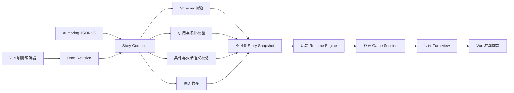

# Cycle Master 剧情系统 v3 重构设计

> 状态：已完成交互式设计确认，待书面复核
> 日期：2026-07-26
> 关联审计：`plan/reports/2026-07-26-全面架构与剧情系统审查报告.md`

## 1. 背景

当前项目已经形成以节点 JSON 为主要内容源、FastAPI 提供游戏接口、Vue 负责展示和编辑的基础结构，但运行逻辑、创作模型和存档模型之间仍存在多套事实来源：

- JSON 中存在运行时未执行或被转换丢失的配置。
- 选项条件、锁定显示和跳转模式在数据层、后端和前端的解释不一致。
- 客户端可以提交完整游戏状态，后端不能保证存档和恢复结果可信。
- 编辑器直接写入剧情文件，缺少路径边界、修订冲突、完整校验和原子发布。
- 旧数据库剧情表与 JSON 剧情源并存，并通过外键错误地耦合存档。
- 测试能够证明基础流程可运行，但不足以证明剧情语义正确。

项目尚未发布，现有存档均为测试数据。因此本次设计不提供旧存档兼容层，允许重建数据库，并将剧情格式一次性迁移到 v3。

## 2. 已确认的决策

1. 采用分阶段实施，而不是一次提交全部改造。
2. 最终使用不兼容的 v3 剧情模型，不保留旧存档。
3. 保留“每个剧情节点一个 JSON 文件”的创作方式。
4. 后端是游戏状态的唯一权威来源。
5. 本轮建设完整剧情编辑器，而非只修复现有元数据编辑器。
6. 使用模块化单体和编译式剧情系统，不引入微服务、消息队列或事件溯源。
7. 保持 Vue 3、TypeScript、Vite、FastAPI、Pydantic、SQLAlchemy 和 SQLite 技术栈。

## 3. 目标与非目标

### 3.1 目标

- 建立一套可严格验证、可无损编辑、可原子发布的剧情格式。
- 消除隐藏规则和“配置存在但运行时不执行”的情况。
- 让选项可见性、可用性、效果、跳转和结局具有唯一且可测试的语义。
- 让后端以事务方式处理选择，拒绝伪造状态、重复提交和并发旧请求。
- 让编辑器完整覆盖节点、内容块、选项、条件、效果和拓扑。
- 将现有剧情迁移到 v3，并修复审计中发现的剧情语义错误。
- 建立不会污染正式剧情数据的自动化测试和 CI 质量门。

### 3.2 非目标

- 不兼容旧存档、旧会话或旧数据库内容。
- 不支持多人联机或跨设备实时协作编辑。
- 不把剧情正文迁入 SQLite。
- 不做通用脚本语言，也不允许剧情 JSON 执行任意代码。
- 不在本次重构中引入全局文本片段复用系统。
- 不通过保留 v2/v3 双运行引擎来降低迁移风险。

## 4. 总体架构



架构中有三个明确边界：

1. Authoring JSON 是创作事实来源，追求人类可读和稳定 diff。
2. Story Snapshot 是运行事实来源，由编译器生成，应用运行时只读。
3. Game Session 是玩家状态事实来源，仅由后端状态转换产生。

## 5. 剧情数据模型

### 5.1 文件组织

建议目录：

```text
data/
  story_v3/
    project.json
    nodes/
      A.json
      B.json
      ...
    assets.json
  story_build/
    <revision>/
      manifest.json
      story.snapshot.json
      diagnostics.json
```

- `project.json` 保存入口节点、允许的属性、物品、标志、跳转模式和全局限制。
- `nodes/*.json` 保存节点内容及从该节点发出的选择。
- `assets.json` 保存资源 ID 与实际路径的映射。
- `story_build` 仅包含生成物，不作为人工编辑入口。
- `manifest.json` 完全由编译器生成。

节点文件名不参与业务语义。节点 ID 来自文件内容，但编译器要求文件名与 ID 一致，以降低误操作风险。

### 5.2 节点模型

节点保持以下顶层结构：

```json
{
  "schema_version": 3,
  "id": "A",
  "meta": {},
  "scene": {},
  "entry_sequences": [],
  "choices": [],
  "routing": {},
  "authoring": {}
}
```

这些分组被保留，但每个分组改用关闭式 Schema：

- 禁止未声明字段。
- 所有 ID 使用受限格式，如 `^[A-Za-z][A-Za-z0-9_-]{0,63}$`。
- 显示名称、作者备注和稳定 ID 分离。
- `authoring` 只能保存不会影响运行结果的编辑信息。
- 所有会影响运行结果的字段必须进入正式运行 Schema。

### 5.3 内容块

`entry_sequences` 和选择结果统一使用类型化内容块：

```json
{
  "type": "dialogue",
  "speaker_id": "zhang",
  "text": "……"
}
```

首批支持：

- `narration`
- `dialogue`
- `system`
- `check_result`

每种内容块都有独立必填字段。运行时不得依靠某个可选字段是否存在来猜测内容类型。

### 5.4 条件

废弃混合自然语言的条件字符串。条件使用递归的类型化表达式树：

```json
{
  "type": "all",
  "conditions": [
    {
      "type": "attribute_compare",
      "attribute": "zhang_trust",
      "operator": "gte",
      "value": 3
    },
    {
      "type": "flag_equals",
      "flag": "notebook_complete",
      "value": true
    }
  ]
}
```

首批原子条件包括：

- 属性比较。
- 标志值比较。
- 拥有或缺少物品。
- 已完成周目比较。
- 节点访问次数比较。
- 选择历史比较。

组合条件包括 `all`、`any` 和 `not`。条件描述由编辑器根据表达式生成，也允许独立的作者备注，但备注不参与执行。

所有属性、标志和物品引用必须存在于项目定义中。编译器拒绝未知引用、错误值类型和不受支持的运算符。

### 5.5 效果

效果使用可辨识联合类型：

```json
{
  "type": "modify_attribute",
  "attribute": "sanity",
  "operation": "add",
  "value": -5,
  "clamp": true
}
```

首批效果包括：

- 修改属性。
- 设置标志。
- 添加或移除物品。
- 记录交互。
- 标记一次性效果已经执行。
- 增加已完成周目。

效果必须明确目标、操作和值类型。引擎不接受任意路径写入，也不允许静默忽略未知效果。

### 5.6 选项与跳转

选项结构包含：

```json
{
  "id": "A_choice_01",
  "text": "进入商场",
  "availability": {
    "condition": null,
    "locked_visibility": "hide",
    "locked_reason": null
  },
  "effects": [],
  "result": [],
  "next": {
    "target": "S01",
    "mode": "travel"
  }
}
```

规则：

- `locked_visibility=hide`：条件不满足时不向前端返回。
- `locked_visibility=show`：条件不满足时返回禁用选项和锁定原因。
- `next.mode` 是强类型枚举，至少支持 `travel`、`warp` 和 `shortcut`。
- 跳转模式必须经过对应策略执行，不能在图加载阶段被丢弃。
- 每条视觉拓扑边必须对应具体选择，不维护第二套独立边集合。
- 动态生成的选项只能来自显式运行规则，不能与静态选项形成重复权威来源。
- 选项在 `choices` 数组中的顺序就是唯一展示顺序；删除容易并列的 `priority` 排序语义。

### 5.7 周目语义

状态只持久化：

```text
completed_cycles: int >= 0
```

当前显示周目为：

```text
current_cycle = completed_cycles + 1
```

剧情条件必须明确引用 `completed_cycles` 或 `current_cycle`，不能继续使用语义不清的 `cycle_count`。

### 5.8 Schema 权威来源

Pydantic v3 模型是可执行 Schema 的唯一权威来源，并由它生成：

- 供编辑器和外部工具使用的 JSON Schema。
- 供前端使用的 TypeScript 类型。
- 带固定版本的格式文档。

`schema_version` 是必填字段，并且本运行引擎只接受精确值 `3`。CI 会重新生成这些产物并检查工作区差异，防止手写 JSON Schema、Pydantic 和 TypeScript 类型逐渐分叉。

## 6. Story Compiler

### 6.1 编译阶段

编译器依次执行：

1. 加载项目、资源和所有节点。
2. 进行 JSON Schema/Pydantic 结构校验。
3. 建立 ID 索引并检查重复与悬空引用。
4. 验证条件和效果的类型、目标及取值范围。
5. 构建由选择产生的有向图。
6. 进行可达性、终局、死路和特殊跳转分析。
7. 执行项目级剧情规则。
8. 规范化排序并生成稳定内容哈希。
9. 输出不可变快照、manifest 和诊断报告。

任何阻断级错误都会使编译失败，不更新活动快照。

### 6.2 诊断等级

- `error`：会造成不确定运行、数据损坏或明确不可达，禁止发布。
- `warning`：可能是作者有意设计，但需要人工确认。
- `info`：统计和维护提示。

诊断必须包含稳定代码、节点/选项定位、可读消息和可选修复建议，供 CLI、测试和编辑器复用。

### 6.3 拓扑检查

至少检查：

- 从入口不可达的节点。
- 非终局节点没有可执行出口。
- 引用不存在节点的跳转。
- 同一业务出口的静态和动态重复定义。
- 父级、区域或作者标注与实际边冲突。
- 条件在已声明属性边界内必然不成立。
- 一次性效果缺少作用域键。
- 特殊节点回到前序流程造成的非预期回退。

S10、S13、S14、S19、S20 的父级和连线关系在迁移时以实际剧情意图重新校正，不保留当前冲突标注。

### 6.4 资源检查

资源通过逻辑 ID 引用。编译器检查：

- 资源 ID 是否登记。
- 文件是否存在。
- 类型是否与使用位置一致。
- 必填资源是否缺失。

音频仍为可选字段；不会为了通过校验创建虚假的空音频文件。

## 7. 运行时与游戏会话

### 7.1 API 契约

创建会话：

```text
POST /api/sessions
```

执行选择：

```text
POST /api/sessions/{session_id}/choose
{
  "turn_revision": 12,
  "choice_id": "A_choice_07"
}
```

恢复会话：

```text
GET /api/sessions/{session_id}
```

前端不再上传节点、物品、属性、标志或周目等完整状态。

### 7.2 原子状态转换

选择处理遵循以下事务：

1. 加载会话及绑定的 `story_revision`。
2. 校验 `turn_revision`。
3. 由服务端重新计算当前可见和可用选项。
4. 拒绝不存在、不可见或不可用的选择。
5. 深拷贝或创建不可变工作状态。
6. 在工作状态上顺序执行效果、限制和跳转。
7. 验证新状态的全部不变量。
8. 在单个数据库事务中写入新状态和选择记录。
9. 提交成功后返回新的回合视图。

任何异常都不得改变原会话。旧 `turn_revision` 返回冲突响应，使重复点击和并发请求可安全处理。

### 7.3 回合视图

后端返回展示所需的只读数据：

- 当前节点和场景。
- 当前内容块。
- 可见选项。
- 禁用选项及结构化锁定原因。
- 可展示的玩家属性和物品。
- `completed_cycles` 与派生的 `current_cycle`。
- `session_id`、`turn_revision` 和 `story_revision`。
- 明确的运行状态：`active`、`ending`、`cycle_complete` 或 `blocked`。

前端不重新执行条件，也不通过空选项猜测结局。

### 7.4 已知玩法修复

- K 区出口只保留一个生成来源，所有出口统一执行理智值上限代价。
- E 区深度 NPC 互动由服务端计数，达到两次后禁止继续。
- 调整张警官信任值写入或 H 区阈值，使 H_choice_01 存在合法可达路径。
- S20 恢复改为带明确作用域键的一次性效果，重复进入不再重复恢复。
- `warp`、`travel`、`shortcut` 均执行其正式语义。
- 所有非终局软锁会在编译或运行不变量检查中成为明确错误。

最终采用哪一种数值修正，例如提高 `zhang_trust` 的可获得上限还是降低 H 区阈值，由迁移任务依据剧情文档确定，并通过可达性测试固定结果。

## 8. 持久化

### 8.1 删除旧内容表耦合

删除作为剧情来源的旧 `StoryNode`、`Choice` 表及其相关加载器。剧情内容只来自已发布 Story Snapshot。

### 8.2 新会话数据

数据库保存：

- 会话 ID。
- 当前节点和运行状态。
- `story_revision`。
- `turn_revision`。
- 权威玩家状态 JSON 或结构化状态字段。
- 创建、更新时间。
- 必要的选择审计记录。

节点 ID 不再外键关联数据库剧情表。合法性由绑定的 Story Snapshot 保证。

### 8.3 数据库初始化

初始化只创建新 Schema，不再需要向数据库预填剧情节点。开发和测试数据库可以直接删除后重建。

进程内无限增长的 `TurnStore` 被持久化会话仓库替换。必要的内存缓存必须有容量和失效边界，且不能成为权威状态源。

## 9. 编辑器

### 9.1 能力范围

完整编辑器支持：

- 节点元数据与场景资源。
- 入场内容序列。
- 选项及排序。
- 条件树。
- 效果列表。
- 结果内容块。
- 目标节点和跳转模式。
- 拓扑布局和作者备注。
- 编译诊断、预览、草稿和发布。

### 9.2 草稿与发布

编辑器不直接覆盖活动剧情：

1. 基于已知 `base_revision` 创建或更新草稿。
2. 使用字段级 PATCH 修改结构化数据。
3. 每次保存执行局部结构校验。
4. 发布前执行完整编译。
5. 编译成功后写入新的修订目录。
6. 原子切换活动版本指针。

活动版本切换失败时，旧版本保持不变；草稿及诊断保留。

### 9.3 无损编辑

- 表单必须覆盖全部运行字段。
- JSON 解析后再序列化不得改变字段语义。
- 不把 `show` 自动改成 `hide`。
- 不把 `warp` 或 `shortcut` 自动改成 `travel`。
- 编辑器不认识的 v3 字段应触发版本不兼容错误，不能静默删除。
- manifest 和内容哈希不由浏览器生成。

### 9.4 安全

- 节点 ID 在 API 层和仓库层分别校验。
- 文件路径由受信任根目录与验证后的 ID 组合。
- 解析后的目标路径必须仍位于受信任根目录。
- 禁止客户端提交文件名、相对路径或绝对路径。
- 编辑 API 默认仅在开发模式启用，并要求独立编辑令牌。
- 生产模式不注册或拒绝所有剧情写接口。
- 写入采用临时文件、落盘和原子替换。
- API 对请求体大小、节点数量和文本长度设定上限。

### 9.5 拓扑画布

- 监听节点与连线的实际内容变化。
- 拖拽创建边时正确区分 source 和 target。
- 边直接编辑对应选择的 `next`。
- 删除边必须明确选择是清空跳转还是删除选择。
- ID 由稳定生成器产生，不再使用 `Date.now()`。
- 图中区分普通移动、传送、捷径、锁定和不可达状态。
- 有阻断级诊断时禁止发布。
- 编辑确认、冲突和错误反馈统一使用应用内模态框与通知，不调用浏览器原生 `prompt`、`alert` 或 `confirm`。

### 9.6 预览沙盒

编辑器可以基于草稿快照和固定初始状态启动预览。预览会话：

- 使用独立命名空间。
- 不写入正式游戏会话。
- 不改变活动剧情版本。
- 显示条件计算和效果执行轨迹，帮助定位隐藏逻辑。

## 10. 前端

### 10.1 游戏界面拆分

`GamePlay.vue` 只负责页面编排，业务拆分为：

- 回合数据容器。
- 内容块渲染器。
- 选项列表及禁用原因。
- 玩家状态面板。
- 加载、冲突和错误恢复层。
- 结局与周目完成视图。

状态仓库只调用会话 API 和保存当前回合视图，不实现剧情规则。

### 10.2 错误恢复

- 请求失败时保留当前画面和会话。
- 重试使用同一会话、同一命令和幂等信息。
- 版本冲突时刷新权威回合，不创建新游戏。
- 会话失效、剧情版本不可用和普通网络错误分别提示。
- 只有玩家明确选择“新游戏”时才创建新会话。

### 10.3 资源展示

前端通过统一资源解析器使用逻辑资源 ID。开发环境中缺失资源显示可识别占位，不把后端路径或无效 URL 直接交给组件。

迁移阶段必须修正当前 8 个失效背景引用。其余未配置背景的节点需要被作者明确标记为“允许无背景”或补充资源，不能在编译器中无声通过。

音频由单一 `AudioController` 管理。切换节点、恢复会话、离开游戏页面和组件卸载时都必须停止或释放旧音频；空音频保持合法可选值，不创建占位音频文件。

## 11. 测试与质量门

### 11.1 测试策略

每个缺陷先建立失败测试，再实现最小修复。测试层次：

1. Schema、条件、效果和状态转换单元测试。
2. 编译器与仓库集成测试。
3. 会话 API 和事务测试。
4. 编辑器组件与无损往返测试。
5. 核心玩家路径 E2E。
6. 全图语义审计。

### 11.2 必须覆盖的回归

安全与编辑：

- `../manifest` 等节点 ID 无法逃逸剧情目录。
- `locked_visibility` 和 `next.mode` 往返不变。
- 修订冲突不会覆盖新版本。
- 任意编译或写入失败不会产生混合版本。
- manifest 只由编译器生成。

运行逻辑：

- `show` 类型锁定选项可见但不可点击，`hide` 类型完全不可见。
- 第一次游戏显示第一周目，完成后显示第二周目。
- K 区不存在重复出口，所有出口执行相同代价规则。
- E 区最多完成两次受限深度互动。
- H_choice_01 存在可执行路径。
- S20 同一作用域只恢复一次。
- 三种跳转模式都能到达正确目标并执行正确附加语义。
- 效果中途失败时原状态不变。

权威状态：

- 客户端不能伪造节点、属性、物品或周目。
- 重复选择请求不会执行两次效果。
- 旧回合版本返回冲突。
- 服务重启后会话仍可恢复。
- 全新数据库可以立即创建会话和存档。

数据和拓扑：

- 所有正式节点从入口可达，或被明确标记为非运行草稿。
- 所有引用均存在。
- 非终局节点至少存在一条可满足出口。
- S10、S13、S14、S19、S20 的归属与实际拓扑一致。
- 所有必需资源存在。

### 11.3 测试隔离

- 每次后端测试使用独立临时数据库。
- 编辑器和 E2E 使用剧情目录的临时副本。
- 测试不得修改 `data/story_v3` 正式源文件。
- 测试不依赖执行顺序。
- 禁止通过吞异常、固定长等待、强制点击或测试内递归重跑制造假通过。

### 11.4 CI

合并前至少执行：

- 后端单元与集成测试。
- 前端单元测试。
- TypeScript 类型检查。
- 前端生产构建。
- 严格剧情编译。
- 核心 E2E。

Python 依赖必须收敛到一个受版本控制的声明入口和锁定口径，开发说明、测试与 CI 使用同一安装方式；CI 额外检查代码实际导入的直接依赖均已声明。

## 12. 分阶段实施

### Phase 1：数据与安全基础

- 定义 v3 Schema 和项目注册表。
- 建立 Story Compiler、诊断模型和不可变快照。
- 建立 v2 到 v3 的一次性迁移工具。
- 修复仓库路径边界和原子写入。
- 建立新数据库 Schema 和测试隔离。
- 迁移全部现有剧情并使严格编译通过。

完成标准：正式 v3 剧情能够独立编译；不存在路径穿越；全新数据库无需剧情种子即可工作。

### Phase 2：权威运行引擎

- 建立持久化会话与回合版本。
- 实现不可变、事务化状态转换。
- 改造会话 API。
- 实现条件、效果、选项可见性和跳转策略。
- 修复 K、E、H、S20、周目与终局问题。

完成标准：前端无法提交或伪造完整状态；所有已知玩法缺陷均有回归测试。

### Phase 3：完整编辑器

- 建立草稿、PATCH、诊断和原子发布 API。
- 实现完整节点、内容块、条件、效果和选项编辑。
- 重构拓扑画布。
- 实现预览沙盒和诊断展示。

完成标准：任意正式 v3 节点都能无损打开、修改、校验和发布。

### Phase 4：前端与质量体系

- 拆分游戏界面和状态仓库。
- 改善错误、冲突、终局和重试流程。
- 建立资源解析与缺失资源诊断。
- 重写脆弱 E2E 并接入 CI。
- 收敛 Python 依赖声明与安装文档。
- 用应用内组件替代原生浏览器弹窗，并统一音频生命周期。
- 运行全量回归和全图语义审计。

完成标准：所有质量门通过，不再依赖 v2 运行代码和旧数据库内容表。

## 13. 切换与清理

由于无需兼容旧存档，最终切换步骤为：

1. 冻结 v2 剧情编辑。
2. 运行迁移工具生成 v3 源文件。
3. 修复全部阻断诊断并生成首个 v3 快照。
4. 重建开发和测试数据库。
5. 将前后端切换到新会话 API。
6. 完成全量回归后删除 v2 加载器、旧 API、旧内容表和兼容代码。

如果切换验证失败，代码可以回退到切换前提交；v2 剧情在最终验收前保留为只读备份。不存在对玩家存档的回滚要求。

## 14. 风险与控制

### 14.1 剧情迁移改变语义

控制方式：迁移工具保留稳定 ID；为每个节点生成迁移差异；对所有已知关键路径建立黄金测试。

### 14.2 条件可满足性分析不完备

控制方式：首版只对有限属性域和已知原子条件做确定性分析；无法证明时输出 warning，不假装证明正确。

### 14.3 完整编辑器范围过大

控制方式：编辑器复用同一组生成的 TypeScript/Pydantic 契约和诊断 API；按内容、规则、拓扑三个可独立验收的垂直切片实现。

### 14.4 发布时读取混合数据

控制方式：运行引擎只加载带哈希的完整快照；发布通过单一活动版本指针原子切换，不逐个替换运行文件。

### 14.5 长会话绑定旧剧情版本

控制方式：会话始终绑定创建时的 `story_revision`。清理旧快照前检查是否仍有引用；开发阶段也可以显式终止全部测试会话。

## 15. 验收标准

整体重构只有在以下条件全部满足时才完成：

- 审计报告中所有 P0 和 P1 问题均有自动化回归测试并通过。
- P2 中拓扑、S20、伪结构化配置、前端错误恢复、GraphCanvas、编辑器边界、测试污染和资源诊断问题均完成。
- P3 中 Schema 漂移、manifest 校验、选项排序、依赖口径和原生交互问题均完成。
- v3 正式剧情严格编译无错误。
- 后端状态转换具备事务性和并发版本保护。
- 编辑器能够无损编辑并原子发布完整剧情结构。
- 全新环境可初始化、创建游戏、保存、重启并恢复会话。
- 后端测试、前端测试、类型检查、生产构建和核心 E2E 全部通过。
- 已删除不再使用的 v2 运行路径、旧剧情数据库表和客户端权威状态接口。

## 16. 后续实施文档

本设计批准后，下一步使用 `superpowers:writing-plans` 编写逐文件实施计划。计划必须：

- 将四个 Phase 拆成小步、可独立验证的任务。
- 为每个行为修复指定先失败后通过的测试。
- 标注新增、修改和删除的准确文件。
- 在删除旧代码前设置明确迁移门和回滚点。
- 每个 Phase 结束运行对应质量门，整体完成前运行全量验证。
