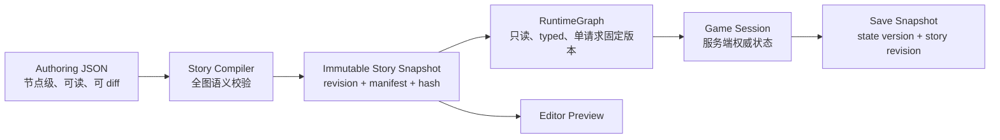

# Cycle Master 全面架构与剧情系统审查报告

> 审查日期：2026-07-26
> 审查范围：剧情选项可见性、循环状态、剧情拓扑、特殊路由、v2 剧情存储、编辑器、存档、前后端契约、测试体系与资源链路
> 审查方式：静态代码审查、全量剧情数据扫描、临时目录破坏性场景复现、隔离数据库复现、单元测试、生产构建与关键 Playwright 回归
> 本报告只给出结论和优化方案；除本报告外未修改项目源码或正式剧情数据。

---

## 一、执行结论

### 1.1 总体判断

项目的基础方向是可继续演进的，不需要推倒重写：

- v2 剧情已经成为运行时唯一剧情源；
- 节点级 JSON 适合 Git 管理、人工审阅和内容协作；
- `entry_sequences + result_blocks` 可以表达有顺序的旁白与对话；
- 30 个节点、143 个选项在忽略条件时全部静态可达；
- Pydantic 严格模型、单文件原子替换、Turn 防重放等基础设施已经具备。

但当前不能把“测试通过”和“静态可达”理解成玩法正确。项目的主要问题已经从“代码能否运行”转为四类语义断裂：

1. **数据声明与运行时行为不一致**
   `locked_visibility`、`next.mode`、`routing.crossing`、`routing.warp` 等字段看似已配置，运行时却丢弃、绕过或硬编码。

2. **状态语义不统一**
   `cycle_count` 同时被当作“已完成循环数”和“当前第几轮”；flag 与 attribute 混用，已造成真实剧情永久不可达。

3. **编辑器不是无损编辑器**
   对选项做一次看似无害的读取和保存，就可能把 `show` 改成 `hide`、把 `warp/shortcut` 改成 `travel`；还存在目录穿越覆盖任意可写 JSON 的问题。

4. **运行时与存档的权威边界不完整**
   Turn ID 防住了普通选项重放，但 `/resume` 与存档写入仍信任客户端完整状态；选择失败时还可能保留部分已应用效果。

### 1.2 当前健康等级

| 维度 | 结论 |
|---|---|
| 静态数据结构 | 良好：30/30 可达，引用、ID、manifest 当前一致 |
| 核心玩法语义 | 高风险：轮次、K、E、H 均有已复现逻辑错误 |
| 编辑安全 | 不合格：存在 P0 目录穿越和 P1 无损往返失败 |
| 存档与会话 | 高风险：全新数据库无法存档，恢复入口可伪造状态 |
| 前端可维护性 | 一般：播放器与编辑器均存在高耦合和错误恢复问题 |
| 自动化测试 | 数量多但有效保护不足，缺少语义图验证与隔离 |
| 美术/音频资源链路 | 未完成：8 个背景引用全部缺失，音频为空 |

**建议：暂停继续批量扩写剧情和扩大编辑器写入范围，先完成 P0/P1 收敛。**

---

## 二、审计基线与证据

### 2.1 数据规模

| 项目 | 数量 |
|---|---:|
| 节点文件 | 30 |
| 选项 | 143 |
| entry sequences | 50 |
| 内容块 | 846 |
| entry blocks | 342 |
| result blocks | 504 |
| narration blocks | 744 |
| dialogue blocks | 102 |
| effects | 110 |
| 非空运行/触发条件字段 | 118 |

其他统计：

- 导航模式：82 `stay`、49 `travel`、9 `warp`、3 `shortcut`。
- 可见性：134 `show`、9 `hide`。
- 143 个选项目前全部是 `once_per_visit`。
- 精确重复文本为 12 组、28 个 block，占 3.3%；目前不足以支持把文本拆成全局碎片库。

### 2.2 基线验证

- `python scripts/audit_phase1_5.py --strict`：通过。
- 后端测试：88 passed。
- 前端单测：3 passed。
- `vue-tsc --noEmit && vite build`：通过。
- 生产构建存在非阻塞警告：
  - 主 chunk 约 1.04 MB；
  - Sass legacy JS API 弃用警告。
- E2E 共收集 181 项，但其中有：
  - 64 处固定 `wait_for_timeout`；
  - 12 处 `force=True`；
  - 34 处 `except Exception: pass`；
  - 13 处 `pytest.skip`；
  - 9 处在 E2E 内再次启动子测试/构建。

### 2.3 静态健康不等于语义健康

当前严格校验器只验证：

- 文件能被 Pydantic 解析；
- ID 不重复；
- choice 目标存在；
- 至少有一个默认 entry；
- 忽略条件时可从 A 静态到达。

它无法发现：

- 条件引用了永远不会产生的状态；
- flag/attribute 命名空间用错；
- 当前轮次整体偏移；
- K 同一出口有两条、其中一条绕过代价；
- crossing 配置从未被执行；
- parent/authoring 与真实边不一致；
- effect 类型、target、value 只在玩家选到时才报错。

---

## 三、问题总表

### P0：立即封堵

| ID | 问题 | 直接影响 |
|---|---|---|
| P0-01 | 编辑器节点 ID 可目录穿越 | 可覆盖 manifest、`frontend/package.json` 等任意可写 JSON |
| P0-02 | 全新安装数据库无法创建存档 | 被忽略的 DB 没有 story rows，外键导致 `FOREIGN KEY constraint failed` |

### P1：核心逻辑或数据安全

| ID | 问题 | 直接影响 |
|---|---|---|
| P1-01 | `locked_visibility=show` 完全失效 | 134 个 show 配置无法按契约显示；至少 31 个带条件 show 选项被隐藏 |
| P1-02 | `cycle_count` 0/1 基语义冲突 | 首轮显示后续轮回文本，解锁普遍晚一轮 |
| P1-03 | K 出口双份且静态出口免成本 | 玩家可绕过 sanity_max -1 |
| P1-04 | E crossing 互动上限未实现 | 配置最多互动 2 人，实际 6 人都能深入互动 |
| P1-05 | `H_choice_01` 永久不可达 | 完整版循环笔记本无法正常获得 |
| P1-06 | 编辑器 choice round-trip 有损 | `show→hide`、`warp/shortcut→travel` |
| P1-07 | `/resume` 和存档写入信任客户端状态 | 可伪造轮次、节点、道具、flags 后获得合法 Turn |
| P1-08 | 选择处理不具事务性 | 失败选择可能留下部分 effect、已消费 choice 或错误节点 |
| P1-09 | 编辑存储无 revision/锁/多文件事务 | 并发丢更新、跨文件半提交、运行帧混用两个版本 |
| P1-10 | 旧 E2E 直接修改 canonical 剧情 | 测试失败或中断会污染正式 JSON |

### P2：架构、体验和维护风险

| ID | 问题 |
|---|---|
| P2-01 | 5 个子节点的 parent、入口、出口、authoring 不一致 |
| P2-02 | S20 “一次性恢复”可在同轮反复使用，恢复量也不符合设计 |
| P2-03 | SQLite StoryNode/Choice 与 v2 JSON 形成遗留双模型 |
| P2-04 | `trigger_condition` 混装机器条件与自然语言 |
| P2-05 | routing/authoring 大量开放 dict，很多字段只是“伪配置” |
| P2-06 | 当前“剧情编辑器”只能编辑少量元数据 |
| P2-07 | 空选项节点没有 terminal/soft-lock 处理 |
| P2-08 | 选择错误会覆盖当前画面，“重试”实际重新开局 |
| P2-09 | GraphCanvas 对同数量的数据更新不敏感，删除语义和后端相反 |
| P2-10 | 8 个背景引用全部 404，21 个节点无背景，音频资源为空 |
| P2-11 | `GamePlay.vue` 职责过重，测试难以稳定覆盖 |
| P2-12 | TurnStore 无 TTL/容量限制且仅进程内有效 |
| P2-13 | 测试重复、慢、吞异常，且没有仓库内 CI 质量门 |

### P3：后续治理

| ID | 问题 |
|---|---|
| P3-01 | JSON Schema 不能表达全部 Pydantic 语义，`schema_version` 还可省略 |
| P3-02 | manifest 是手工冗余数据，没有自动更新或 checksum |
| P3-03 | priority 允许同节点并列，保存顺序可能改变展示顺序 |
| P3-04 | Python 依赖环境和 requirements 不一致，版本口径分散 |
| P3-05 | 浏览器原生 prompt/alert/confirm 和音频生命周期不适合最终桌面体验 |

---

## 四、详细问题与优化建议

## 4.1 P0-01：编辑器目录穿越

### 证据

- `backend/app/editor/story_repository.py:99-117` 只对 ID 做 `strip()`，随后直接拼接：
  - `self.root / f"{node_id}.json"`
- `backend/app/editor/story_repository.py:45-53` 用 `replace()` 覆盖目标文件。
- `backend/app/routers/editor.py:22-29` 接收裸 `dict`。
- 编辑器 API 没有鉴权或生产禁用开关。

独立临时目录复现：

```text
id = "../manifest"
返回 created
nodes/../manifest.json 被成功创建或覆盖
```

使用更多 `../` 可到达 `frontend/package.json` 等文件。

### 优化

立即措施：

1. ID 使用明确正则，例如 `^[A-Z][A-Z0-9_]{0,63}$`。
2. 拒绝 `/`、`\`、`..`、绝对路径、Windows 保留名。
3. 对候选路径 `resolve()`，断言其 parent 严格等于 nodes root。
4. 编辑器写 API 默认仅开发环境启用，并要求本地认证令牌。

目标方案：

- ID 与文件名分离；
- 文件名由服务端或 manifest 映射生成；
- 客户端永远不能提交实际路径。

---

## 4.2 P0-02：全新数据库无法存档

### 证据

- `data/*.db` 被 `.gitignore` 忽略，正式仓库不携带当前本地数据库。
- `backend/app/database.py:67-83` 启动只 `create_all()` 和补列，不导入 v2 节点。
- `backend/app/models/save.py:58` 的 `Save.current_node_id` 外键指向 `story_nodes.id`。
- `backend/app/models/save.py:93` 的持久节点外键也指向 `story_nodes.id`。
- 当前运行时明确不再读取 story tables。

隔离空数据库复现：

```text
create_all()
create_save(GameState(current_node_id="A"))
=> FOREIGN KEY constraint failed
```

现有测试没有暴露问题，因为 `test_save_regressions.py` 会在每个测试里手工插入 StoryNode。

### 优化

推荐删除存档对 legacy story tables 的数据库外键：

- `current_node_id` 和 persistent node key 保存为稳定字符串；
- 创建/加载存档时由当前发布的 `RuntimeGraph` 校验节点存在；
- 存档增加 `story_revision` 和 `state_schema_version`；
- 若剧情版本变化，通过迁移器处理被重命名/删除的节点。

如果短期必须保留 FK，则启动时要从发布的 v2 snapshot 自动同步只含 ID 的 node registry，但这只能作为过渡方案。

---

## 4.3 P1-01：选项显示契约断裂

### 证据链

1. v2 数据保留 `locked_visibility: show|hide`：
   - `backend/app/schemas/story_v2.py:87-100`
2. `GraphBundle` 也保留了该值：
   - `backend/app/engine/graph.py:147-157`
3. 引擎条件失败时无条件 `continue`：
   - `backend/app/engine/engine.py:261-278`
4. `ChoiceResult` 本来可以表达 `available=False` 和 `reason`：
   - `backend/app/schemas/game.py:125-138`
5. 前端又做了一次 `available` 过滤：
   - `frontend/src/player/choiceVisibility.ts:5-7`
6. GamePlay 没有展示锁定原因：
   - `frontend/src/views/GamePlay.vue:68-80`

真实表现：

- 新游戏 A 只返回 3 个可执行选项；
- `A_choice_03` 配置为 `show`，仍然彻底消失；
- 所有 API 响应中的 `available=False` 数量始终为 0。

### 优化

建议恢复字段本身表达的语义：

- `show`：返回 `available=False`，按钮禁用并显示 `hint` 或条件说明；
- `hide`：不返回；
- 重复策略耗尽应单独定义是 hide 还是 disabled，不能借用条件锁定语义。

如果产品最终决定“所有不可执行项都隐藏”，应彻底删除 `locked_visibility`、`available=False`、`reason` 以及相关文档，而不是保留一套无效配置。

---

## 4.4 P1-02：循环轮次偏移

### 证据

- 新状态 `cycle_count=0`：`backend/app/schemas/game.py:69-82`。
- 只有正常回到 A 后才 `+1`：`backend/app/engine/engine.py:168-174`。
- 数据却把 `cycle==1` 当作“第一次”：
  - `A_起点.json:603-663`
  - D 的 cycle_1 内容也描述第一次到达。

独立复现：

```text
cycle_count=0 执行 A_choice_07
首段结果为“你再次点开租房APP……”
```

这意味着：

- 第一次游玩先看到“已经被困”的后续文本；
- 第一次完整回环后，反而出现首次文本；
- `cycle>=2`、`cycle>=3` 解锁普遍晚一轮。

### 优化

不要继续让一个字段承担两个概念。推荐：

```text
completed_cycles：已完成完整循环数，初始 0
current_cycle：当前第几轮，派生为 completed_cycles + 1
```

编剧条件使用 `current_cycle`，引擎统计使用 `completed_cycles`。迁移时：

1. 扫描全部 `cycle*` 条件和 entry sequence；
2. 根据文本语义迁移；
3. 为旧存档记录 state schema version；
4. 增加第 1、2、3 轮黄金路径测试。

---

## 4.5 P1-03：K 跃迁存在两套权威

### 证据

- K JSON 已定义 `K_choice_02..09` 八个静态出口。
- SpecialRouter 又注入 `__warp_K_exit_A..H`：
  - `backend/app/engine/special_router.py:89-100`
- 动态出口硬编码 `sanity_max -1`：
  - `backend/app/engine/special_router.py:158-180`
- 静态出口 effects 为空。
- `GraphBundle.from_story_v2()` 丢弃了 `next.mode`：
  - `backend/app/engine/graph.py:140-159`

独立复现：

```text
K→A 同时出现：
__warp_K_exit_A
K_choice_02

动态出口：sanity_max 100 → 99
静态出口：sanity_max 不存在/不扣除
```

### 优化

推荐保留静态 choice 作为出口唯一来源，因为它们已经拥有完整结果文本：

1. `ChoiceData` 保留 `next.mode`。
2. 引擎看到 `mode=warp` 时统一读取 typed `routing.warp.cost` 并应用。
3. SpecialRouter 只负责“从其他节点注入进入 K 的入口”。
4. 删除动态 K 出口生成逻辑。
5. 禁止同一节点、同一导航 mode、同一 target 出现重复出口。

同时把当前硬编码 cost 改为真正消费 K 数据中的配置。

---

## 4.6 P1-04：E crossing 配置未执行

### 证据

E 的 routing 声明：

```json
{
  "max_npc_interactions": 2,
  "available_npcs": ["...6个 NPC..."]
}
```

但 `E_choice_05..10` 只使用 `at_node:E`，GameEngine 和 SpecialRouter 没有 crossing interaction count。

独立复现：

```text
选择 E_choice_05
选择 E_choice_06
E_choice_07/08/09/10 仍全部可用
```

### 优化

新增显式的 crossing scope，例如：

```text
crossing_visit_id
crossing_interaction_count
crossing_interacted_npcs
```

由服务端按 `max_npc_interactions` 生成/校验选择。必须明确：

- 离开 E 后是否重置；
- 再次进入 E 是否新建 crossing；
- 跨循环是否重置；
- 存档恢复如何还原；
- 超额 NPC 是隐藏、置灰，还是“仅观察”。

---

## 4.7 P1-05：H 完整笔记本分支永久不可达

### 证据

- D 把 `zhang_trust` 写入 `flags`，值最多到 2。
- `H_choice_01` 检查的是 `attr:zhang_trust>=3`：
  - `data/story_data_v2/nodes/H_康王路.json:201-209`
- 默认 attribute 只有 sanity、courage、insight：
  - `backend/app/schemas/game.py:76-79`
- 全图没有任何写入 attribute `zhang_trust` 的 effect。

### 优化

先由编剧确认正式语义，再选一种：

- 信任是枚举/阶段：保留 flag，并支持 typed flag 数值比较；
- 信任是数值属性：所有写入和读取统一迁到 attribute，并补足达到阈值 3 的路径。

校验器必须建立“状态符号表”，检查：

- 所有 `attr:*` 是否在默认值或 effect producer 中存在；
- 所有关键 flag 是否存在 producer；
- 阈值是否在可达到的取值范围内。

---

## 4.8 P1-06：编辑器不是无损 round-trip

### 证据

- list API 把所有 choice 固定映射为 `is_hidden_when_locked=True`：
  - `story_repository.py:73-87`
- save API 固定写 `locked_visibility=hide`：
  - `story_repository.py:163-178`
- save API 只按“是否同节点”推导 stay/travel，丢失 shortcut/warp。
- UI 没有 visibility 和 navigation mode 控件：
  - `InspectorPanel.vue:28-49`

独立临时副本复现：

```text
A_choice_03: show → 读取 → 原样保存 → hide
K_choice_02: warp → 读取 → 原样保存 → travel
```

### 优化

禁止再用旧扁平 DTO 重建完整对象。改为：

- lossless field-level PATCH/command API；
- 未提交字段原样保留；
- choice ID 不可变；
- DTO 明确包含 `locked_visibility`、`repeat_policy`、`next.mode`；
- 全量 30 节点/143 choices 做 GET→PATCH(no-op) 语义等价测试。

---

## 4.9 P1-07：恢复与存档绕过服务端权威状态

### 证据

- `/resume` 接收客户端完整 `GameState` 后直接签发 Turn：
  - `backend/app/routers/game.py:108-117`
- `POST/PUT /api/saves` 也接收客户端完整 GameState：
  - `backend/app/routers/saves.py:96-138,141-182`

独立复现：

```text
current_node_id=K
cycle_count=999
inventory=[forged_item × 99]

/resume 成功，返回合法 turn_id，伪造状态被完整保留。
```

### 优化

服务端权威命令应是：

```text
start() -> session_id + turn_id
choose(session_id, turn_id, choice_id)
discard(session_id, turn_id, item_id)
save(session_id, turn_id, slot_name)
resume(save_id) -> new session_id + turn_id
```

客户端不再提交完整 GameState。单机桌面版可先使用进程内 session repository，之后再决定是否持久化；无需为此引入复杂分布式架构。

---

## 4.10 P1-08：选择处理非事务

### 证据

- effect 直接原地修改 state：
  - `backend/app/engine/engine.py:337-436`
- route 出错后恢复的是同一个、可能已经变更的对象：
  - `backend/app/routers/game.py:146-161`
- condition/effect 在数据加载阶段未被完整语义验证。

独立复现：

```text
effects = [
  set_flag(partial_effect=true),
  bogus_effect
]

第二个 effect 报错后 partial_effect 仍为 true。
如果 route restore 该 state，旧 turn 也包含 partial_effect=true。
```

### 优化

1. 所有 condition/effect 在加载和编辑保存时编译校验。
2. `process_choice` 在深拷贝上工作。
3. 完成 effect、导航、内容解析、Frame 构建后再原子提交新 state。
4. 任何异常恢复执行前快照，而不是恢复工作副本。

---

## 4.11 P1-09：编辑存储缺少版本事务

### 证据

- 所有写入是无锁 read-modify-write。
- `_atomic_write()` 只保证单文件不会写半截。
- choice 跨节点移动需要顺序写两个文件：
  - `story_repository.py:179-191`
- 崩溃在中间会造成 choice 暂时或永久丢失/重复。
- 运行请求先拿 graph，后又从 loader 当前状态取 blocks：
  - `game.py:145-155`
- 并发 reload 时，一个 Frame 可能混用两个剧情版本。
- manifest 从不随 create/delete 自动更新。

### 优化

轻量但可靠的方案：

1. 引入 `story_revision`。
2. 客户端 PATCH 携带 `If-Match/revision`，冲突返回 409。
3. 仓库写操作使用单进程 lock；如支持多进程，再加文件锁。
4. 修改在 staging snapshot 上完成全图验证。
5. 一次性切换当前 snapshot/revision。
6. 每个游戏请求只捕获一个不可变 `StorySnapshot`。
7. manifest 由 snapshot 自动生成，不允许手工维护。

---

## 4.12 P1-10：E2E 会污染正式剧情

`tests/e2e/test_phase3_editor.py` 直接修改 A 和已有 choices，再手工恢复。测试失败、超时、浏览器崩溃或进程中断都会跳过恢复。

由于当前 round-trip 本身有损，即使“恢复文本”也可能把：

- `show` 改成 `hide`；
- `warp/shortcut` 改成 `travel`。

### 优化

- 后端支持 `CYCLE_MASTER_STORY_ROOT`；
- 每次 E2E 复制 canonical snapshot 到临时目录；
- 每个测试使用独立数据库和独立 story revision；
- 测试退出时删除临时副本；
- CI 禁止编辑器 E2E 指向正式 `data/story_data_v2`。

---

## 五、拓扑与剧情数据专项问题

## 5.1 子节点归属与实际边不一致

| 节点 | meta.parent | 实际入口 | 实际返回/问题 |
|---|---|---|---|
| S10 | E | F | 实际是 F→S10→F |
| S13 | F | G | 实际是 G→S13→G |
| S14 | F | G | 实际是 G→S14→G |
| S19 | G | H | S19 返回 G，H authoring 未列 |
| S20 | G | H | S20 返回 G，H authoring 未列 |

H→S19/S20→G 会让玩家回退并重走 G→H。

建议明确 `parent_node_id` 的定义：

- 如果表示“入口拥有者”，必须等于实际 incoming edge 的来源；
- 如果表示“剧情段归属”，另建字段，不要参与运行拓扑；
- `linked_sub_nodes` 应由 choices 边派生或做强一致性校验。

## 5.2 S20 恢复逻辑不符合设计

设计描述为“一次性、恢复到进入 S20 前水平”，当前实现却是：

- `once_per_visit`；
- 固定 `heal sanity 5`。

离开 S20 后再进入，同一轮仍可再次使用。

建议使用显式一次性 flag/scope；如果确实要恢复进入前状态，应在进入 S20 时保存 sanity snapshot，而不是固定 +5。

## 5.3 `trigger_condition` 混装两种语义

20 个非空 `meta.trigger_condition` 中，19 个是自然语言或机器语法与自然语言混合，例如：

```text
and:has_flag:saw_2014_girl,H节点天台楼梯间开放
```

该字段进入 GraphBundle，但没有运行时消费者。

建议拆为：

```text
trigger_rule：typed condition，只供机器执行
trigger_description：自然语言，只供编剧和编辑器展示
```

## 5.4 routing/authoring 的“伪结构化”

当前以下字段大量使用 `dict[str, Any]`：

- crossing；
- shortcut；
- warp；
- linked_sub_nodes；
- scene_items；
- npc_item_mapping；
- gender_variant。

部分字段没有消费者，部分被运行时硬编码覆盖。例如 K 数据声明 warp cost，但 SpecialRouter 自己硬编码扣除逻辑。

每个字段必须做三选一：

1. 建 typed model，并由运行时真正消费；
2. 明确改名为 `authoring_notes`；
3. 删除。

不要继续保留“看起来可配置、实际不生效”的字段。

---

## 六、前端与编辑器架构

## 6.1 GamePlay 职责过重

`frontend/src/views/GamePlay.vue` 约 503 行，同时负责：

- 播放状态机；
- 打字机；
- Markdown；
- 选择提交；
- 场景转场；
- 背景；
- 环境音；
- 背包；
- 存档；
- 地图；
- 通知和 screen effects；
- 大量样式。

建议拆为：

```text
GamePlayPage
├── usePlaybackController
├── useSceneMedia
├── useGameCommands
├── StoryTimeline
├── ChoiceList
├── InventoryPanel
├── SavePanel
└── SceneTransition
```

先锁定行为测试，再拆分；不要把玩法修复与大规模视觉重写绑在同一个提交。

## 6.2 错误恢复会误导玩家

- `gameStore.choose()` 出错后保留旧 Frame，但设置全局 error。
- GamePlay error 分支覆盖游戏画面。
- 唯一“重试”按钮实际调用 `/start`，等于重新开局。

建议：

- 有现存 Frame 时错误以 toast/banner 显示；
- 400 保留原 turn 允许修正；
- 409 提供重新签发当前 session turn 或读档；
- 网络未知结果必须先查询 session 状态，避免重复提交；
- 不把“重试”和“新游戏”混为一个动作。

## 6.3 GraphCanvas 状态容易陈旧

- 只 watch `nodes.length` 和 `choices.length`。
- 修改名称、类型、目标节点但数量不变时，图可能不重建。
- UI 提示“删除节点及其所有连接”，后端却采用 restrict 并返回 409。
- 拖拽连线代码没有保存 mousedown 的真正 source。
- choice ID 由 `Date.now()` 生成，多客户端或同毫秒存在碰撞。

建议：

- 图以完整 normalized graph revision 更新；
- 删除操作明确选择 restrict 或 cascade；
- ID 由服务端生成 UUID/ULID；
- 拖拽连线保存 source 和 target，不再混用 prompt。

## 6.4 当前编辑器能力边界

正文 textarea 是 readonly，后端对已有节点也忽略 content。当前 UI 无法编辑：

- entry sequence；
- 内容块顺序/type/speaker/when；
- result blocks；
- effects；
- routing；
- authoring；
- 可见性；
- 导航 mode。

短期应将产品名称改为“拓扑与元数据编辑器”，避免误导。完成 lossless PATCH 和 revision 后，再扩展为真正的剧情编辑器。

---

## 七、存储结构应该怎么改

### 7.1 不建议把剧情正文迁入 SQLite

当前问题不在于 JSON 本身。节点级 JSON 的优势仍然明显：

- 可 Git diff；
- 可人工 code review；
- 编剧可直接定位节点；
- 部署时可作为只读资源；
- 30 节点规模无需数据库查询优化。

而把 846 个 block 全拆成数据库行会增加迁移、编辑事务、排序和审阅成本，并不能自动解决语义不一致。

### 7.2 推荐的存储分层



### 7.3 Authoring JSON 建议

继续保留：

- 一个节点一个文件；
- stable node/choice/block ID；
- `entry_sequences`；
- `result_blocks`；
- node-scoped choices。

需要改造：

- condition：从自由字符串升级为可编译 AST，或至少在加载时编译；
- effects：discriminated union，按 type 约束 target/value；
- navigation：typed union，保留 mode；
- routing：typed crossing/shortcut/warp；
- trigger rule 与 description 分离；
- manifest 自动生成；
- schema version 必填；
- 增加 content revision。

### 7.4 不建议过早做全局文本复用

全量 exact duplicate 只有 3.3%。当前更合适的是：

- 允许 sequence 继承基础 blocks 或条件增量；
- 减少 C/D 中多轮 entry 的整段复制；
- 暂不建立全局 fragment 数据库，避免编剧修改一处意外影响多场景。

---

## 八、推荐目标架构

## 8.1 后端模块边界

```text
story/
├── authoring_models.py
├── condition_ast.py
├── effect_models.py
├── compiler.py
├── semantic_validator.py
├── snapshot.py
└── repository.py

game/
├── state.py
├── commands.py
├── reducer.py
├── session_repository.py
├── turn_service.py
└── frame_builder.py

saves/
├── models.py
├── repository.py
└── migrations.py

editor/
├── commands.py
├── revision_service.py
├── preview.py
└── publish.py
```

关键原则：

- Story compiler 是运行时与编辑器共用的唯一验证入口。
- Game reducer 输入不可变 snapshot 和 command，输出新 state/domain events。
- Frame 构建成功后才提交新 Turn。
- Save 不依赖 legacy StoryNode/Choice ORM。
- 编辑修改 authoring snapshot，不直接逐字段改 live runtime。

## 8.2 运行时状态

建议把状态分成：

```text
PlayerState
WorldState
LoopState
VisitState
CrossingState
ChoiceHistory
```

并明确作用域：

- permanent：永久；
- loop：本轮；
- visit：本次节点访问；
- crossing：本次穿越；
- turn：单次命令。

现在的 `flags: dict[str, Any]` 可以在迁移期保留，但新功能必须通过 typed accessor 或 state schema 注册，禁止继续随意加入字符串 key。

---

## 九、测试体系重建

### 9.1 推荐测试金字塔

1. **Story compiler tests**
   - 全量 schema；
   - condition/effect 编译；
   - producer/consumer；
   - parent/edge/routing 一致性；
   - 重复出口与 soft-lock；
   - manifest/hash。

2. **State machine/model tests**
   - 不启动浏览器；
   - 对 RuntimeGraph 做多轮路径遍历；
   - 检查第 1/2/3 轮；
   - 检查 K/E/J；
   - 检查所有关键道具/flag 最终可达。

3. **API contract tests**
   - session/turn；
   - stale/replay；
   - save/resume；
   - 事务回滚；
   - editor revision/409。

4. **组件测试**
   - ChoiceList 的 show/hide/disabled/reason；
   - playback reducer；
   -错误恢复；
   - GraphCanvas 更新。

5. **Playwright**
   - 只保留少量关键旅程；
   - 禁止固定等待、force click、吞异常；
   - 全部使用临时 story/database。

### 9.2 必须加入 CI 的质量门

```text
story schema + semantic validator
backend unit/API tests
frontend typecheck + unit/component tests
production build
critical Playwright journeys
git diff check：测试后 canonical data 必须无变化
```

---

## 十、分阶段实施路线

## Phase 0：安全止血（建议最先完成）

1. 封堵节点 ID 目录穿越。
2. 生产环境默认禁用编辑器写 API。
3. 修复全新数据库无法存档。
4. E2E 改用临时 story root。
5. 给当前 canonical story 建只读 hash 基线。

完成标准：

- 路径攻击测试全部拒绝；
- 删除本地 DB 后，新游戏→存档→加载可用；
- E2E 前后 canonical 目录 hash 不变。

## Phase 1：玩法正确性

1. 明确 `completed_cycles/current_cycle` 并迁移条件。
2. K 出口只保留一个权威来源。
3. 实现 E crossing scope。
4. 修复 H_choice_01 状态域和阈值。
5. 恢复 `locked_visibility` 的真实语义。
6. 选择处理改为 copy-on-write 事务。
7. Loader 启动时执行全图语义编译。

完成标准：

- 第 1/2/3 轮黄金路径通过；
- K 每个目标只有一个出口且代价一致；
- E 第 3 次深入互动被正确限制；
- 完整笔记本可通过合法路径获得；
- 任意失败 command 后 state 深度等于执行前。

## Phase 2：剧情存储与编辑器

1. 改成 revisioned lossless PATCH。
2. manifest 自动生成。
3. 引入 immutable StorySnapshot。
4. 单请求固定 story revision。
5. 清理 legacy GraphLoader/StoryNode/Choice 或迁移为独立 node registry。
6. editor 增加 diff、preview、undo/publish。

完成标准：

- 30/143 全量 no-op round-trip 等价；
- 并发编辑冲突返回 409；
- 故障注入不会产生半提交；
- gameplay frame 内 revision 一致。

## Phase 3：前端与测试

1. 拆分 GamePlay。
2. 错误恢复不再重开游戏。
3. 修复 GraphCanvas 响应式更新与连线。
4. 去除 E2E 的固定等待、force、吞异常和重复子测试。
5. 建立 CI。

## Phase 4：内容和资源

1. 修正 5 个子节点归属/路径。
2. 修正 S20 一次性恢复。
3. 清理 trigger/routing/authoring dead fields。
4. 补齐 8 个已引用背景，并统一 `/assets/backgrounds/...` 目录约定。
5. 为 21 个空背景节点制定资源计划。
6. 建立 asset manifest 和存在性校验。

---

## 十一、必须新增的回归测试

### 安全与编辑

- `../manifest`、绝对路径、斜杠、Windows 保留名全部拒绝。
- show/hide、stay/travel/shortcut/warp 全字段 round-trip。
- result blocks、effects、short label 未编辑时保持不变。
- 两个 revision 并发修改：一方成功，一方 409。
- 跨节点 move 故障注入后可恢复。

### 玩法

- 新游戏显示首次剧情。
- 首次 H→A 后显示第二轮剧情。
- 第三轮条件恰好在第三轮出现。
- K 每个 target 只有一个出口并统一扣费。
- E 深入互动最多 2 次。
- H 完整笔记本分支可通过真实路径获得。
- S20 同轮不可重复恢复。
- 任意非终局节点都不会进入空选项 soft-lock。

### 状态与存档

- 空数据库可存档/读档。
- 修改客户端 load payload 后不能升级为可信 Turn。
- effect 中途失败后 state 完全回滚。
- stale/unknown turn 不清空当前 UI。
- story revision 变化时存档迁移行为明确。

### 数据

- 所有 condition 在发布前编译。
- 所有 effect type/target/value 在发布前验证。
- attr/flag producer-consumer 对账。
- parent/linked/incoming/outgoing 一致。
- asset 引用存在。
- manifest 自动生成且 hash 一致。

---

## 十二、不建议做的事情

1. **不建议立即把剧情全文搬入 SQLite。**
   这会增加复杂度，却不能解决语义校验、事务和编辑器有损问题。

2. **不建议先重写整个 GamePlay。**
   应先用测试固定正确行为，再拆组件。

3. **不建议继续增加自由字符串 flag/condition/effect。**
   新内容越多，状态域混用和永久不可达越难修。

4. **不建议把当前 181 项 E2E 全部保留并继续堆测试。**
   应删除重复和源码字符串测试，把大部分状态路径下沉到模型/API 测试。

5. **不建议在 P0/P1 未收敛前开放编辑器给非开发用户。**

---

## 十三、最终建议

项目应沿着“保留 v2 JSON、增加编译与发布层、建立服务端权威状态、把编辑器改成无损 revisioned command”这一方向优化。

最关键的先后顺序是：

```text
安全止血
→ 修正轮次/K/E/H/选项显示
→ 事务化 GameState
→ 无损版本化编辑
→ 清理遗留双模型
→ 拆前端与重建测试
→ 扩写剧情和补资源
```

完成前两阶段后，项目才适合继续大规模写剧情；完成第三阶段后，编辑器才适合成为正式内容生产工具。
