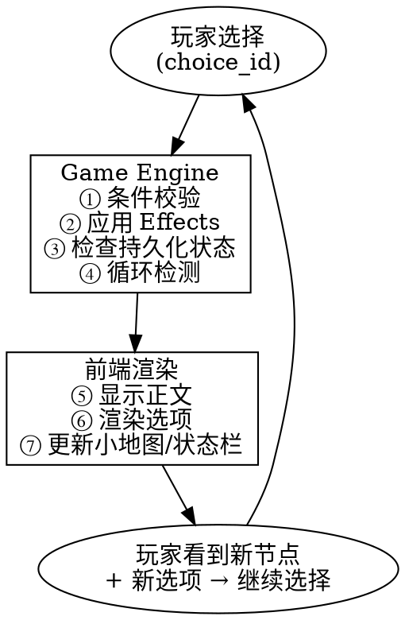

# Cycle Master — 技术实现方案 v1.0

> **项目定位**：莫比乌斯环无限循环视觉小说游戏  
> **核心理念**：剧本 = 有向循环图，玩游戏 = 状态在图上遍历（借鉴 LangGraph 状态图思想）  
> **平台策略**：Web 优先（Vue 3），后期通过 Tauri 打包桌面应用

---

## 一、技术栈总览

| 层 | 技术 | 说明 |
|---|---|---|
| 前端框架 | **Vue 3 + Vite** | Composition API + `<script setup>` |
| 前端语言 | **TypeScript** | 类型安全，减少运行时错误 |
| UI 组件库 | **Element Plus** | 成熟稳定的 Vue 3 组件库 |
| 图渲染（编辑画布） | **Cytoscape.js** | 完整的图节点/边操作能力 |
| 图渲染（游戏小地图） | **手写 SVG** | 环形进度条，轻量无需重型库 |
| 状态管理 | **Pinia** | Vue 官方推荐状态管理 |
| 样式方案 | **SCSS** | 视觉小说对自定义样式需求高 |
| 后端框架 | **Python 3.12 + FastAPI** | 异步高性能，原生 Pydantic 集成 |
| ORM | **SQLAlchemy 2.0** | ORM + 原生 SQL 可混用 |
| 数据校验 | **Pydantic v2** | FastAPI 原生集成，类型安全 |
| 数据库 | **SQLite** | 零配置，单文件部署 |
| 桌面打包（未来） | **Tauri 2.x** | 比 Electron 更轻量 |

---

## 二、核心设计理念：图节点状态机

### 2.1 莫比乌斯环的图模型

```
俯视展开：

  起点(0m) ──→ 普通节点 ──→ 50m关键节点 ──→ 普通节点
    ↑                                            │
    │                                            ↓
  150m关键节点 ←── 普通节点 ←── 100m关键节点 ←── 普通节点
    │                                            │
    └────────────────────────────────────────────┘
            （回到起点 = 一次循环完成）
```

- **关键节点**（4 个）：固定在 50m / 100m / 150m / 起点(=0m) 的位置，构成环形骨架
- **普通节点**（若干）：散落在关键节点之间，由编剧自由放置
- **边（Choice）** = 玩家的选择，每条边从当前节点指向下一个节点
- **边的条件** = 状态谓词，根据玩家属性/道具/历史选择决定是否可用
- **方向**：沿环面单向推进，分支导向不同子路径

### 2.2 类比 LangGraph

| LangGraph 概念 | 本游戏对应 |
|---|---|
| `StateGraph` | 整个故事剧本 |
| `Node` | 故事节点（一段对话/旁白） |
| `Edge` | 玩家选择（Choice） |
| `ConditionalEdge` | 带条件的选项（需某道具/某标记才可触发） |
| `GraphState` | `GameState`（携带道具、标记、循环数） |
| `node update` | `Effect`（选择带来的状态变更） |
| `graph.invoke()` | `engine.process_choice()`（处理选择，推进游戏） |

---

## 三、数据模型

### 3.1 核心对象定义

```python
class StoryNode:
    id: str                          # 唯一标识，如 "node_050"
    name: str                        # 显示名称，如 "废弃工厂入口"
    position: float                  # 环面上位置 (0.0 ~ 200.0)
    is_key_node: bool                # 是否关键节点
    content: str                     # 正文（支持 Markdown）
    speaker: str | None              # 说话人（None = 旁白）
    background: str | None           # 背景图路径
    persistent_items: list[Item]     # 遗留道具（跨循环持久化）
    persistent_dangers: list[Danger] # 遗留危险（跨循环持久化）

class Choice:
    id: str
    from_node_id: str                # 来源节点
    text: str                        # 选项文本
    next_node_id: str                # 目标节点
    condition: str | None            # 条件表达式（状态谓词）
    effects: list[Effect]            # 选择触发的效果

class Effect:
    type: str     # "add_item" | "remove_item" | "set_flag" | 
                  # "remove_flag" | "trigger_danger" | "heal" | "damage"
    target: str   # 目标对象
    value: any    # 参数值

class GameState:
    current_node_id: str
    cycle_count: int                 # 第几次循环
    inventory: list[Item]            # 携带道具
    flags: dict[str, any]            # 全局标记
    visited_nodes: list[str]         # 本轮已访问节点
    endings_reached: list[str]       # 已达成的结局
    player_attributes: dict[str, int] # 玩家属性（如 sanity, courage 等）
```

### 3.2 条件表达式语法

条件的求值逻辑：**根据当前 GameState 判定 choice 是否对玩家可见/可选**。

类型：
- `has_item:道具ID` — 背包中是否持有某道具
- `has_flag:标记名` — 是否存在某标记
- `flag:标记名=值` — 某标记是否等于指定值
- `attr:属性名>=值` — 玩家属性比较
- `cycle>=N` — 循环次数条件
- `not:条件` — 取反
- `and:条件1,条件2` — 同时满足
- `or:条件1,条件2` — 满足其一

示例：`"and:has_item:key_001,attr:courage>=5"` — 需要持有钥匙且勇气≥5。

---

## 四、数据库设计（SQLite）

### 4.1 剧本定义表（编辑器写入，只读）

```sql
-- 故事节点表
CREATE TABLE story_nodes (
    id           TEXT PRIMARY KEY,
    name         TEXT NOT NULL,
    position     REAL NOT NULL,          -- 0.0 ~ 200.0
    is_key_node  INTEGER DEFAULT 0,
    content      TEXT NOT NULL,
    speaker      TEXT,
    background   TEXT
);

-- 选择分支表
CREATE TABLE choices (
    id            TEXT PRIMARY KEY,
    from_node_id  TEXT NOT NULL REFERENCES story_nodes(id),
    text          TEXT NOT NULL,
    next_node_id  TEXT NOT NULL REFERENCES story_nodes(id),
    condition     TEXT,                  -- JSON 格式条件表达式
    effects       TEXT NOT NULL DEFAULT '[]'  -- JSON 格式 Effect 列表
);

-- 索引
CREATE INDEX idx_choices_from ON choices(from_node_id);
```

### 4.2 存档数据表（游戏运行时读写）

```sql
-- 存档表
CREATE TABLE saves (
    id              TEXT PRIMARY KEY,
    save_name       TEXT NOT NULL,
    created_at      TEXT NOT NULL DEFAULT (datetime('now')),
    updated_at      TEXT NOT NULL DEFAULT (datetime('now')),
    current_node_id TEXT NOT NULL REFERENCES story_nodes(id),
    cycle_count     INTEGER DEFAULT 0,
    inventory       TEXT DEFAULT '[]',   -- JSON
    flags           TEXT DEFAULT '{}',   -- JSON
    visited_nodes   TEXT DEFAULT '[]',   -- JSON
    player_attributes TEXT DEFAULT '{}', -- JSON
    endings_reached TEXT DEFAULT '[]'    -- JSON
);

-- 节点遗留状态表（存档级隔离 — 不同存档的遗留物独立）
CREATE TABLE node_persistent_state (
    id        TEXT PRIMARY KEY,
    save_id   TEXT NOT NULL REFERENCES saves(id),
    node_id   TEXT NOT NULL REFERENCES story_nodes(id),
    items     TEXT DEFAULT '[]',         -- JSON
    dangers   TEXT DEFAULT '[]',         -- JSON
    UNIQUE(save_id, node_id)
);

CREATE INDEX idx_persist_save ON node_persistent_state(save_id);
```

---

## 五、架构分层

```
┌──────────────────────────────────────────────────┐
│            Layer 4: 可视化编辑器                   │
│   NodeListPanel │ GraphCanvas │ InspectorPanel    │
│   Vue 3 + Cytoscape.js + Element Plus             │
├──────────────────────────────────────────────────┤
│            Layer 3: 游戏播放器                     │
│   NarrativePanel │ ChoicePanel │ StatusBar        │
│   CycleMap(SVG) │ SaveLoadPanel                   │
│   Vue 3 + Pinia + SCSS                            │
├──────────────────────────────────────────────────┤
│            Layer 2: 图引擎（核心）                  │
│   graph.py │ engine.py │ condition_eval.py        │
│   Python FastAPI + Pydantic v2                    │
├──────────────────────────────────────────────────┤
│            Layer 1: 数据持久化                     │
│   SQLite + SQLAlchemy 2.0                         │
└──────────────────────────────────────────────────┘
```

---

## 六、图引擎 API 设计

### 6.1 RESTful 端点

| 方法 | 路径 | 用途 |
|---|---|---|
| `GET` | `/api/game/start` | 初始化新游戏，返回起点节点 + 初始 GameState |
| `POST` | `/api/game/choose/{node_id}` | 提交选择（body: `{choice_id}`）→ 返回下一帧 |
| `GET` | `/api/game/state/{save_id}` | 获取当前存档的游戏状态（恢复用） |
| `POST` | `/api/saves` | 创建新存档 |
| `GET` | `/api/saves` | 获取所有存档列表 |
| `PUT` | `/api/saves/{save_id}` | 保存游戏进度 |
| `DELETE` | `/api/saves/{save_id}` | 删除存档 |
| `GET` | `/api/editor/nodes` | 获取所有节点（编辑器用） |
| `POST` | `/api/editor/nodes` | 创建/更新节点 |
| `DELETE` | `/api/editor/nodes/{node_id}` | 删除节点 |
| `GET` | `/api/editor/choices/{node_id}` | 获取某节点的所有选择 |
| `POST` | `/api/editor/choices` | 创建/更新选择 |

### 6.2 核心请求/响应格式

```json
// POST /api/game/choose/{node_id}
// Request
{ "choice_id": "choice_abc" }

// Response: Frame（一帧游戏画面）
{
  "node": {
    "id": "node_050",
    "name": "废弃工厂入口",
    "content": "你站在工厂大门前...",
    "speaker": null,
    "background": "/assets/bg/factory.jpg"
  },
  "state": {
    "cycle_count": 3,
    "inventory": [{"id": "item_key", "name": "生锈的钥匙"}],
    "flags": {"unlocked_gate": true},
    "player_attributes": {"courage": 7, "sanity": 4}
  },
  "available_choices": [
    {
      "id": "c1",
      "text": "推开大门走进去",
      "available": true
    },
    {
      "id": "c2",
      "text": "用钥匙打开侧门",
      "available": false,
      "reason": "需要: 生锈的钥匙"
    }
  ],
  "persistent_found": {
    "items": [{"id": "item_note", "name": "上一轮留下的纸条"}],
    "dangers": []
  },
  "cycle_event": null
}
```

---

## 七、游戏主循环数据流



### 引擎核心伪代码

```python
def process_choice(node_id: str, choice_id: str, state: GameState) -> Frame:
    node = graph.get_node(node_id)
    choice = node.get_choice(choice_id)
    
    # ① 条件校验
    if choice.condition and not evaluator.evaluate(choice.condition, state):
        raise ConditionNotMet()
    
    # ② 应用 Effects（修改 state）
    for effect in choice.effects:
        state = apply_effect(effect, state)
    
    # ③ 跳转目标节点
    next_node = graph.get_node(choice.next_node_id)
    
    # ④ 循环检测
    if next_node.position == 0.0 and state.visited_nodes:
        state.cycle_count += 1
        state.visited_nodes = []
        cycle_event = generate_ending(state)  # 生成循环结局总结
    else:
        cycle_event = None
    
    # ⑤ 加载节点遗留状态
    persistent = db.get_persistent_state(save_id, next_node.id)
    
    # ⑥ 解析可用选项
    available = [
        format_choice(c, evaluator.check(c.condition, state))
        for c in next_node.choices
    ]
    
    return Frame(node=next_node, state=state, choices=available,
                 persistent=persistent, cycle_event=cycle_event)
```

---

## 八、前端组件树

### 8.1 游戏播放器

```
GamePlayer.vue                  # 主容器（路由 /play）
├── BackgroundLayer.vue         # 背景图层（切换动画）
├── NarrativePanel.vue          # 正文显示区
│   ├── SpeakerTag.vue          # 说话人标签
│   └── TypewriterText.vue      # 打字机效果文本
├── ChoicePanel.vue             # 选项按钮列表
│   └── ChoiceButton.vue        # 单个选项（可用/置灰/隐藏）
├── StatusBar.vue               # 顶部状态栏
│   ├── CycleCounter.vue        # 循环数显示
│   ├── InventoryBadge.vue      # 道具栏
│   └── AttributeBar.vue        # 玩家属性条
├── CycleMap.vue                # 环形小地图（SVG）
│   └── 当前位置高亮 + 已访问节点标记
└── SaveLoadPanel.vue           # 存档/读档弹窗
    └── SaveSlot.vue            # 单个存档槽位
```

### 8.2 可视化编辑器

```
EditorLayout.vue                # 三栏布局（路由 /editor）
├── NodeListPanel.vue           # 左栏：节点列表
│   ├── 筛选（按位置/关键词）
│   └── 拖拽排序
├── GraphCanvas.vue             # 中栏：Cytoscape 环形画布
│   ├── 节点可视化（颜色区分关键/普通/当前选中）
│   ├── 边可视化（箭头标注方向，悬停显示条件）
│   ├── 环面背景参考线
│   ├── 右键菜单（新增/删除/编辑）
│   └── 拖拽连线创建 Choice
└── InspectorPanel.vue          # 右栏：属性面板
    ├── 节点属性编辑（名称、内容、背景）
    ├── Choice 列表编辑（增删改、条件表达式、效果）
    └── 遗留道具/危险配置
```

---

## 九、项目目录结构

```
cycle_master/
├── frontend/                       # Vue 3 前端
│   ├── src/
│   │   ├── views/
│   │   │   ├── GamePlay.vue        # 游戏播放器页面
│   │   │   └── EditorLayout.vue    # 可视化编辑器页面
│   │   ├── components/
│   │   │   ├── player/             # 游戏播放器组件
│   │   │   │   ├── NarrativePanel.vue
│   │   │   │   ├── ChoicePanel.vue
│   │   │   │   ├── StatusBar.vue
│   │   │   │   ├── CycleMap.vue
│   │   │   │   └── SaveLoadPanel.vue
│   │   │   └── editor/             # 编辑器组件
│   │   │       ├── NodeListPanel.vue
│   │   │       ├── GraphCanvas.vue
│   │   │       └── InspectorPanel.vue
│   │   ├── stores/                 # Pinia 状态管理
│   │   │   ├── gameStore.ts        # 游戏运行时状态
│   │   │   └── editorStore.ts      # 编辑器状态
│   │   ├── api/                    # API 调用封装
│   │   │   ├── game.ts
│   │   │   ├── saves.ts
│   │   │   └── editor.ts
│   │   ├── types/                  # TypeScript 类型定义
│   │   │   └── index.ts
│   │   ├── router/
│   │   │   └── index.ts
│   │   └── assets/
│   │       └── styles/
│   │           └── variables.scss
│   ├── index.html
│   ├── vite.config.ts
│   └── package.json
│
├── backend/                        # Python FastAPI 后端
│   ├── app/
│   │   ├── main.py                 # FastAPI 入口
│   │   ├── config.py               # 配置管理
│   │   ├── models/                 # SQLAlchemy 模型
│   │   │   ├── story.py            # StoryNode, Choice
│   │   │   └── save.py             # Save, NodePersistentState
│   │   ├── schemas/                # Pydantic 校验模型
│   │   │   ├── game.py             # GameState, Frame, ChoiceResult
│   │   │   └── editor.py           # NodeCreate, ChoiceCreate
│   │   ├── engine/                 # 图引擎核心
│   │   │   ├── graph.py            # 图结构加载/查询
│   │   │   ├── engine.py           # 游戏主循环逻辑
│   │   │   └── condition_eval.py   # 条件表达式解析器
│   │   ├── routers/                # API 路由
│   │   │   ├── game.py             # /api/game/*
│   │   │   ├── saves.py            # /api/saves/*
│   │   │   └── editor.py           # /api/editor/*
│   │   └── database.py             # 数据库连接/Session
│   ├── requirements.txt
│   └── seed_data.py                # 初始测试数据
│
├── docs/                           # 文档
│   └── specs/                      # 设计文档
│
└── 技术实现方案v1.md               # 本文档
```

---

## 十、开发阶段规划

### Phase 1: 骨架搭建（最小可行）

1. 后端项目初始化（FastAPI + SQLite + SQLAlchemy）
2. 前端项目初始化（Vue 3 + Vite + Element Plus + Pinia）
3. 数据库建表 + Pydantic Schema
4. 图引擎核心三模块（graph / engine / condition_eval）
5. 最简 API（`/start` + `/choose`）跑通一个 4 节点的环形 demo
6. 最简前端播放器（显示文本 + 选项按钮）

**里程碑**：能从头到尾走完一次循环（4 个关键节点），看到文本和做出选择。

### Phase 2: 核心机制

1. 条件表达式解析器完整实现
2. 效果系统（道具/标记/属性变更）
3. 跨循环持久化（node_persistent_state）
4. 循环检测 + 结局生成
5. 前端：状态栏、小地图 SVG、打字机效果
6. 存档系统（CRUD）

**里程碑**：多循环游玩、道具系统、跨循环遗留物、存档功能。

### Phase 3: 可视化编辑器

1. Cytoscape.js 图编辑器集成
2. 节点/边的增删改查
3. InspectorPanel 条件/效果编辑器
4. 编辑器 API 对接

**里程碑**：能在可视化编辑器中完整地创建和编辑一个故事剧本。

### Phase 4: 打磨与扩展

1. 背景图/立绘资源管理
2. UI 动画和转场
3. 更多条件/效果类型
4. 音效支持
5. 桌面打包（Tauri）

---

## 十一、关键设计决策

| 决策 | 选择 | 理由 |
|---|---|---|
| 游戏引擎 vs 自研 | 自研图状态机 | 现有引擎（Ren'Py/Ink）为线性叙事设计，循环图需要大量 hack |
| 编辑器与播放器分离 | 同一 Vue 项目，不同路由 | 组件复用，统一���术栈，维护成本低 |
| 条件表达式方案 | 自定义 DSL 字符串 | 简单可控，无需引入规则引擎，JSON 可序列化存入 DB |
| 后端必要性 | 需要后端 | 图引擎逻辑复杂，条件求值和状态管理在服务端更可靠；编辑器需要持久化 |
| 数据库选择 | SQLite | 单机游戏零配置，JSON 字段灵活存储动态结构 |

---

## 十二、验证方式

### 单元测试
- `condition_eval.py` — 条件表达式解析与求值的完整测试矩阵
- `engine.py` — 各种选择场景的效果计算正确性
- 前端 Pinia store 的状态流转测试

### 集成测试
- FastAPI TestClient 测试全部 API 端点
- 模拟走完多个循环的完整游戏流程

### 手动验证
- 启动后端 + 前端，实际游玩测试环型 demo
- 编辑器创建节点 → 切换播放器验证 → 回到编辑器调整

### 验收标准
- [ ] 4 节点环形 demo 可完整游玩一次循环
- [ ] 道具系统：获取道具 → 触发条件选项 → 使用道具 → 下一循环遗留物生效
- [ ] 存档/读档：中断 → 恢复 → 状态完全一致
- [ ] 编辑器可创建、连接、删除节点，保存后播放器可读取
